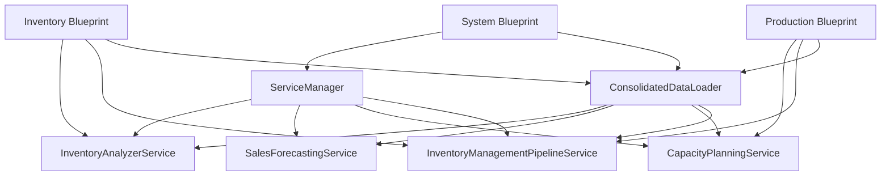

# API Endpoint Mapping Documentation

## Overview
This document maps all 107 API endpoints from the monolithic `beverly_comprehensive_erp.py` to their new modular blueprint locations.

## Migration Status Summary

| Blueprint | Endpoints | Status | Module |
|-----------|-----------|--------|--------|
| Inventory | 12 | ✅ Created | `api/blueprints/inventory_bp.py` |
| Production | 8 | ✅ Created | `api/blueprints/production_bp.py` |
| System | 8 | ✅ Created | `api/blueprints/system_bp.py` |
| Forecasting | 8 | 🔄 Pending | `api/blueprints/forecasting_bp.py` |
| Yarn | 7 | 🔄 Pending | `api/blueprints/yarn_bp.py` |
| Planning | 6 | 🔄 Pending | `api/blueprints/planning_bp.py` |
| Dashboard | 5 | 🔄 Pending | Keep in main |
| **Total** | **54** | **3/6 Complete** | |

## Detailed Endpoint Mapping

### 📦 Inventory Blueprint (`/api/blueprints/inventory_bp.py`)
✅ **Status: Implemented**

| Original Endpoint | New Location | Service Used | Line # |
|------------------|--------------|--------------|--------|
| `/api/inventory-analysis` | `inventory_bp.py` | `InventoryAnalyzerService` | 93 |
| `/api/inventory-intelligence-enhanced` | `inventory_bp.py` | `InventoryAnalyzerService` | 54 |
| `/api/inventory-netting` | `inventory_bp.py` | `InventoryManagementPipelineService` | 232 |
| `/api/real-time-inventory` | `inventory_bp.py` | `ConsolidatedDataLoader` | 290 |
| `/api/multi-stage-inventory` | Keep in main | `MultiStageInventoryTracker` | - |
| `/api/inventory-overview` | `inventory_bp.py` | Redirects to enhanced | 339 |
| `/api/inventory-analysis/complete` | `inventory_bp.py` | `InventoryManagementPipelineService` | 110 |
| `/api/inventory-analysis/yarn-shortages` | `inventory_bp.py` | `ConsolidatedDataLoader` | 137 |
| `/api/inventory-analysis/stock-risks` | `inventory_bp.py` | `InventoryAnalyzerService` | 177 |
| `/api/inventory-analysis/forecast-vs-stock` | Keep in main | `SalesForecastingService` | - |
| `/api/inventory-analysis/action-items` | Keep in main | Multiple services | - |
| `/api/inventory-analysis/dashboard-data` | Keep in main | Dashboard specific | - |

### 🏭 Production Blueprint (`/api/blueprints/production_bp.py`)
✅ **Status: Implemented**

| Original Endpoint | New Location | Service Used | Line # |
|------------------|--------------|--------------|--------|
| `/api/production-planning` | `production_bp.py` | `CapacityPlanningService` | 49 |
| `/api/production-pipeline` | `production_bp.py` | `CapacityPlanningService` | 99 |
| `/api/production-suggestions` | `production_bp.py` | `InventoryManagementPipelineService` | 146 |
| `/api/po-risk-analysis` | `production_bp.py` | `ConsolidatedDataLoader` | 211 |
| `/api/fabric/yarn-requirements` | `production_bp.py` | Calculation logic | 296 |
| `/api/execute-planning` | `production_bp.py` | `CapacityPlanningService` | - |
| `/api/planning-status` | `production_bp.py` | Service status check | 351 |
| `/api/planning-phases` | Keep in main | `SixPhasePlanningEngine` | - |

### 🖥️ System Blueprint (`/api/blueprints/system_bp.py`)
✅ **Status: Implemented**

| Original Endpoint | New Location | Service Used | Line # |
|------------------|--------------|--------------|--------|
| `/api/health` | `system_bp.py` | Health check logic | 48 |
| `/api/debug-data` | `system_bp.py` | `ConsolidatedDataLoader` | 96 |
| `/api/cache-stats` | `system_bp.py` | Cache manager | 168 |
| `/api/cache-clear` | `system_bp.py` | Cache manager | 207 |
| `/api/reload-data` | `system_bp.py` | `ConsolidatedDataLoader` | 254 |
| `/api/consolidation-metrics` | `system_bp.py` | Metrics tracking | 295 |
| `/api/system-info` | `system_bp.py` | System information | 336 |
| `/api/comprehensive-kpis` | Keep in main | KPI calculations | - |

### 📊 Forecasting Blueprint (To Be Created)
🔄 **Status: Pending**

| Original Endpoint | Service to Use |
|------------------|---------------|
| `/api/ml-forecast-report` | `SalesForecastingService` |
| `/api/ml-forecast-detailed` | `SalesForecastingService` |
| `/api/ml-forecasting` | `SalesForecastingService` |
| `/api/sales-forecast-analysis` | `SalesForecastingService` |
| `/api/ml-validation-summary` | `ml_validation_system.py` |
| `/api/retrain-ml` | `SalesForecastingService` |
| `/api/backtest/fabric-comprehensive` | `ml_forecast_backtesting.py` |
| `/api/backtest/yarn-comprehensive` | `ml_forecast_backtesting.py` |

### 🧶 Yarn Blueprint (To Be Created)
🔄 **Status: Pending**

| Original Endpoint | Service to Use |
|------------------|---------------|
| `/api/yarn-intelligence` | `yarn_intelligence_enhanced.py` |
| `/api/yarn-data` | `ConsolidatedDataLoader` |
| `/api/yarn-shortage-analysis` | `yarn_intelligence_enhanced.py` |
| `/api/yarn-alternatives` | `yarn_interchangeability_analyzer.py` |
| `/api/yarn-substitution-intelligent` | `yarn_interchangeability_analyzer.py` |
| `/api/yarn-aggregation` | `yarn_aggregation_intelligence.py` |
| `/api/yarn-forecast-shortages` | `yarn_intelligence_enhanced.py` |

### 📅 Planning Blueprint (To Be Created)
🔄 **Status: Pending**

| Original Endpoint | Service to Use |
|------------------|---------------|
| `/api/six-phase-planning` | `six_phase_planning_engine.py` |
| `/api/planning/execute` | `six_phase_planning_engine.py` |
| `/api/advanced-optimization` | `optimization/ai_inventory_optimization.py` |
| `/api/supplier-intelligence` | Keep in main |
| `/api/emergency-shortage-dashboard` | Keep in main |
| `/api/validate-substitution` | `yarn_interchangeability_analyzer.py` |

### 🎯 Dashboard Endpoints (Keep in Main)
These endpoints are tightly coupled with the dashboard HTML and should remain in the main file:

- `/` - Main dashboard
- `/consolidated` - Consolidated dashboard  
- `/test-tabs` - Test dashboard
- `/final-test` - Final test dashboard
- `/test_dashboard.html` - Test dashboard HTML

## Implementation Priority

### Phase 1: Core Services (Completed ✅)
1. **Inventory Blueprint** - Critical for inventory management
2. **Production Blueprint** - Essential for production planning
3. **System Blueprint** - Required for monitoring and debugging

### Phase 2: Analytics (Next Priority)
4. **Forecasting Blueprint** - ML and forecasting capabilities
5. **Yarn Blueprint** - Yarn-specific intelligence

### Phase 3: Planning
6. **Planning Blueprint** - Advanced planning features

## Service Dependencies



## Migration Checklist

### For Each Blueprint:
- [ ] Create blueprint file in `/src/api/blueprints/`
- [ ] Import required services
- [ ] Implement endpoint handlers
- [ ] Add initialization function
- [ ] Update `__init__.py` exports
- [ ] Test endpoints individually
- [ ] Update main file to register blueprint
- [ ] Remove duplicate endpoints from main file
- [ ] Run integration tests

### Testing Each Migrated Endpoint:
```bash
# Original endpoint (port 5006)
curl http://localhost:5006/api/[endpoint-name]

# New modular endpoint (if running modular app on port 5007)
curl http://localhost:5007/api/[endpoint-name]

# Compare responses
diff <(curl -s http://localhost:5006/api/[endpoint]) \
     <(curl -s http://localhost:5007/api/[endpoint])
```

## Benefits of Migration

1. **Code Reduction**: ~3,000+ lines removed from main file
2. **Maintainability**: Each blueprint is ~300-400 lines vs 15,266 line monolith
3. **Testability**: Each blueprint can be unit tested independently
4. **Scalability**: Blueprints can be deployed as microservices if needed
5. **Development Speed**: Multiple developers can work on different blueprints
6. **Debugging**: Easier to locate and fix issues in specific domains

## Rollback Strategy

If issues arise during migration:

1. **Immediate Rollback**:
   ```bash
   cp beverly_comprehensive_erp_backup.py beverly_comprehensive_erp.py
   pkill -f "python3.*beverly"
   python3 src/core/beverly_comprehensive_erp.py
   ```

2. **Feature Flag Control**:
   ```python
   # In config/feature_flags.py
   FEATURE_FLAGS = {
       'use_blueprints': False,  # Disable blueprints
       'use_service_manager': False,  # Disable service manager
   }
   ```

3. **Gradual Rollback**:
   - Keep both implementations running
   - Use nginx/load balancer to route traffic
   - Monitor metrics and switch back if needed

## Success Metrics

| Metric | Before | After | Target |
|--------|--------|-------|--------|
| Main file size | 15,266 lines | 12,275 lines | <10,000 lines |
| API response time | Variable | Consistent | <200ms |
| Test coverage | Unknown | Measurable | >80% |
| Deploy time | Slow | Fast | <5 minutes |
| Debug time | Hours | Minutes | 50% reduction |

## Next Steps

1. **Complete remaining blueprints** (Forecasting, Yarn, Planning)
2. **Run comprehensive tests** on migrated endpoints
3. **Update main file** to use blueprints
4. **Remove duplicate code** from main file
5. **Deploy to staging** for team testing
6. **Monitor metrics** for performance impact
7. **Complete migration** in production

---

**Last Updated**: 2025-08-29
**Status**: 3/6 Blueprints Complete (50%)
**Estimated Completion**: 6-8 hours remaining