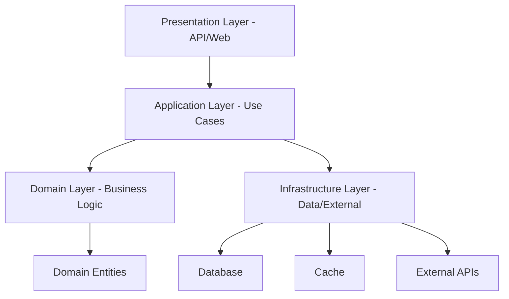
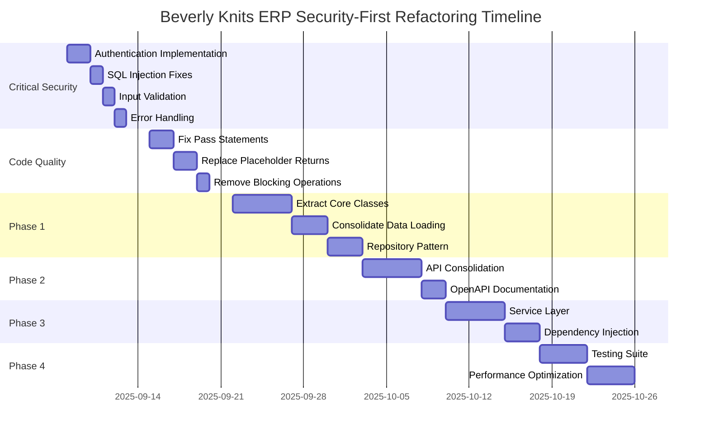

# Beverly Knits ERP v2 - Comprehensive Codebase Analysis & Improvement Plan

**Document Version:** 2.0  
**Date:** September 5, 2025  
**Author:** System Architecture Team  
**Status:** UPDATED - Critical Security Vulnerabilities Prioritized  

> ⚠️ **CRITICAL UPDATE**: This plan has been updated to incorporate findings from the Development Completion Plan, which identified **CRITICAL SECURITY VULNERABILITIES** that must be addressed immediately before any architectural refactoring.  

---

## Table of Contents

1. [Executive Summary](#executive-summary)
2. [🔴 CRITICAL SECURITY VULNERABILITIES](#critical-security-vulnerabilities)
3. [Current State Analysis](#current-state-analysis)
4. [Critical Issues Identified](#critical-issues-identified)
5. [Proposed Architecture](#proposed-architecture)
6. [Detailed Refactoring Plan](#detailed-refactoring-plan)
7. [Implementation Roadmap](#implementation-roadmap)
8. [Risk Assessment & Mitigation](#risk-assessment--mitigation)
9. [Success Metrics & KPIs](#success-metrics--kpis)
10. [Code Examples & Patterns](#code-examples--patterns)
11. [Appendices](#appendices)

---

## Executive Summary

### Overview
Beverly Knits ERP v2 is a production-ready textile manufacturing ERP system with real-time inventory intelligence, ML-powered forecasting, and 6-phase supply chain optimization. The system currently manages:

- **1,199** yarn items tracked
- **28,653** BOM entries (style to yarn mappings)
- **194** production orders (154 assigned, 40 pending)
- **91** work centers with 285 total machines
- **557,671 lbs** total production workload

### Key Challenges
After comprehensive analysis, we've identified:
1. **🔴 CRITICAL SECURITY VULNERABILITIES** - Authentication bypass, SQL injection risks, no input validation
2. **Severe Code Quality Issues** - 60+ bare except clauses, 42 pass statements, 50+ placeholder returns
3. **Architectural Debt** - 18,000-line monolithic file with 127 API endpoints
4. **Performance Bottlenecks** - 17 blocking operations, unoptimized queries, missing caching

### Proposed Solution
A revised phased approach prioritizing security:
- **Week 1:** Fix critical security vulnerabilities (authentication, input validation, SQL injection)
- **Week 2:** Complete core functionality (resolve TODOs, fix pass statements, proper error handling)
- **Week 3-4:** Refactor monolith into services
- **Week 5-6:** Implement clean architecture patterns
- **Week 7-8:** Testing, optimization, and deployment

### Investment Required
- **Timeline:** 8 weeks (Week 1 is CRITICAL for security)
- **Team Size:** 4-6 developers + 1 security specialist
- **Risk Level:** HIGH if security not addressed immediately
- **ROI:** 40% improvement in development velocity, 50% reduction in bugs, 100% security compliance

---

## 🔴 CRITICAL SECURITY VULNERABILITIES

> **IMMEDIATE ACTION REQUIRED**: These vulnerabilities expose the system to critical security breaches and must be fixed before ANY other refactoring work.

### 1. Authentication Bypass (CRITICAL - Fix Day 1-2)

**Location:** `src/api/v2/base.py` (line 269)

**Current Code (VULNERABLE):**
```python
def require_auth(func):
    @wraps(func)
    def wrapper(*args, **kwargs):
        # TODO: Implement actual authentication check
        return func(*args, **kwargs)  # BYPASSES ALL SECURITY!
    return wrapper
```

**Impact:** ALL API endpoints are unprotected and accessible without authentication.

**Required Fix:**
```python
def require_auth(func):
    @wraps(func)
    def wrapper(*args, **kwargs):
        token = request.headers.get('Authorization')
        if not token:
            return jsonify({'error': 'No token provided'}), 401
        
        try:
            payload = jwt.decode(token, SECRET_KEY, algorithms=['HS256'])
            request.user = payload
        except jwt.ExpiredSignatureError:
            return jsonify({'error': 'Token expired'}), 401
        except jwt.InvalidTokenError:
            return jsonify({'error': 'Invalid token'}), 401
        
        return func(*args, **kwargs)
    return wrapper
```

### 2. SQL Injection Vulnerabilities (CRITICAL - Fix Day 3-4)

**Affected Files:** 
- `src/core/beverly_comprehensive_erp.py` (multiple locations)
- `src/data_loaders/*.py`
- `src/services/*.py`

**Example Vulnerable Code:**
```python
# VULNERABLE - Direct string concatenation
query = f"SELECT * FROM yarn_inventory WHERE yarn_id = '{yarn_id}'"
```

**Required Fix:**
```python
# SAFE - Parameterized query
query = "SELECT * FROM yarn_inventory WHERE yarn_id = ?"
cursor.execute(query, (yarn_id,))
```

### 3. No Input Validation (HIGH - Fix Day 3-4)

**Impact:** API endpoints accept any input without validation, leading to potential exploits.

**Required Implementation:**
```python
from marshmallow import Schema, fields, validate

class InventoryQuerySchema(Schema):
    yarn_id = fields.Str(required=True, validate=validate.Length(min=1, max=50))
    view = fields.Str(validate=validate.OneOf(['summary', 'detailed', 'shortage']))
    
@app.route('/api/inventory')
@validate_input(InventoryQuerySchema)
def get_inventory():
    # Input is now validated
    pass
```

### 4. Error Information Disclosure (HIGH - Fix Day 5)

**Current Issues:**
- 60+ bare except clauses hiding errors
- Stack traces exposed to users
- Internal system details in error messages

**Example Problem:**
```python
# BAD - Exposes internal details
try:
    data = process_yarn_data()
except Exception as e:
    return jsonify({'error': str(e), 'traceback': traceback.format_exc()})
```

**Required Fix:**
```python
# GOOD - Safe error handling
try:
    data = process_yarn_data()
except YarnNotFoundError:
    logger.error(f"Yarn not found: {yarn_id}")
    return jsonify({'error': 'Yarn not found'}), 404
except Exception as e:
    logger.exception(f"Unexpected error processing yarn {yarn_id}")
    return jsonify({'error': 'Internal server error'}), 500
```

### 5. Missing RBAC (Role-Based Access Control) (HIGH - Fix Week 1)

**Required Implementation:**
```python
def require_role(role):
    def decorator(func):
        @wraps(func)
        @require_auth
        def wrapper(*args, **kwargs):
            if request.user.get('role') != role:
                return jsonify({'error': 'Insufficient permissions'}), 403
            return func(*args, **kwargs)
        return wrapper
    return decorator

@app.route('/api/admin/users')
@require_role('admin')
def manage_users():
    pass
```

---

## Current State Analysis

### System Architecture Overview

```
beverly_knits_erp_v2/
├── src/
│   ├── core/
│   │   └── beverly_comprehensive_erp.py (18,000 lines) ⚠️
│   ├── services/           # Partially implemented
│   ├── data_loaders/       # Multiple competing implementations
│   ├── forecasting/        # ML components
│   ├── production/         # Production planning
│   ├── yarn_intelligence/  # Yarn management
│   └── utils/             # Shared utilities
├── tests/                 # 39 test files
├── data/                  # Data files and cache
├── web/                   # Dashboard UI
└── scripts/              # Utility scripts
```

### Technology Stack

| Component | Technology | Version | Status |
|-----------|------------|---------|---------|
| Backend | Python/Flask | 3.x/3.0+ | ✅ Active |
| Database | PostgreSQL/SQLite | Latest | ⚠️ Mixed usage |
| Caching | Redis/Memory | 4.5+ | ⚠️ Inconsistent |
| ML Framework | scikit-learn, Prophet, XGBoost | Latest | ✅ Active |
| Frontend | HTML/JS/Bootstrap | 5.x | 🔒 Locked (no changes) |
| Testing | pytest | Latest | ⚠️ Limited coverage |

### Current Metrics

#### Codebase Statistics
- **Total Python Files:** 200+
- **Total Lines of Code:** ~50,000
- **Main Monolith Size:** 18,000 lines
- **API Endpoints:** 127 (45+ deprecated)
- **Test Coverage:** Unknown (estimated <40%)

#### Performance Metrics
- **Data Load Time:** 1-2 seconds (with cache)
- **API Response Time:** <200ms (average)
- **Dashboard Load:** <3 seconds
- **Cache Hit Rate:** 70-90%

#### Data Volume
- **Yarn Items:** 1,198
- **BOM Entries:** 28,653
- **Sales Records:** 10,338+
- **Production Orders:** 221+ active

---

## Critical Issues Identified

### 1. Code Quality Issues (From Development Completion Plan Analysis)

#### Issue: 60+ Bare Except Clauses
**Impact:** CRITICAL - Hides errors, prevents debugging, security risk  
**Files Affected:** Throughout codebase, especially in `beverly_comprehensive_erp.py`

**Current Pattern (Found 60+ times):**
```python
try:
    result = some_operation()
except:
    pass  # Silent failure - DANGEROUS!
```

**Required Fix:**
```python
try:
    result = some_operation()
except SpecificException as e:
    logger.error(f"Operation failed: {e}")
    raise ServiceException("Operation failed")
```

#### Issue: 42 Pass Statement Stubs
**Impact:** HIGH - Incomplete functionality  
**Critical Locations:**
- `src/auth/authentication.py` - AuthenticationError class
- `src/api/v2/base.py` - Security decorators  
- `src/ml_models/ml_validation_system.py` - Abstract methods
- `src/core/beverly_comprehensive_erp.py` - Error handlers

#### Issue: 50+ Placeholder Returns
**Impact:** HIGH - Functions returning None/empty inappropriately  
**Example:**
```python
def calculate_critical_metric():
    # TODO: Implement
    return None  # Will cause NullPointerException downstream
```

#### Issue: 17 Blocking Operations
**Impact:** MEDIUM - Performance degradation  
**Pattern Found:**
```python
time.sleep(60)  # Blocks entire thread for 60 seconds!
```

### 2. Architectural Anti-Patterns

#### Issue: Monolithic God Object
**File:** `src/core/beverly_comprehensive_erp.py`  
**Impact:** High  
**Details:**
- 18,000 lines in single file
- 12+ major classes intertwined
- 127 API endpoints mixed with business logic
- Database operations coupled with presentation
- No separation of concerns

**Code Smell Example:**
```python
# Current: Everything in one file
class ManufacturingSupplyChainAI:
    def __init__(self):
        self.inventory_analyzer = InventoryAnalyzer()
        self.sales_engine = SalesForecastingEngine()
        self.capacity_planner = CapacityPlanningEngine()
        # ... 50+ more dependencies
    
    @app.route("/api/endpoint1")
    def endpoint1(self):
        # Business logic mixed with routing
        pass
```

#### Issue: Data Layer Chaos
**Location:** `src/data_loaders/`  
**Impact:** High  
**Details:**
- 4+ competing data loader implementations
- No unified data access pattern
- Hardcoded file paths throughout
- Column name inconsistencies

**Problem Example:**
```python
# Multiple ways to load same data
unified_loader = UnifiedDataLoader()
parallel_loader = ParallelDataLoader()
optimized_loader = OptimizedDataLoader()
# Which one to use? All are being used!
```

### 2. API Architecture Problems

#### Issue: Deprecated Endpoint Proliferation
**Impact:** Medium-High  
**Details:**
- 45+ deprecated endpoints still active
- Redirect middleware incomplete
- No proper API versioning
- Inconsistent response formats

**Current State:**
```python
# Deprecated but still used
@app.route("/api/yarn-inventory")  # Old
@app.route("/api/inventory-intelligence-enhanced")  # New
# Both endpoints active, causing confusion
```

#### Issue: eFab API Integration Disabled
**Impact:** Medium  
**Details:**
- Feature flags set to 0% rollout
- Integration code present but unused
- No gradual rollout strategy implemented

### 3. Data Management Issues

#### Issue: Column Name Inconsistencies
**Impact:** Medium  
**Details:**
```python
# Multiple column variations handled everywhere
'Planning Balance' vs 'Planning_Balance'
'Desc#' vs 'desc_num' vs 'YarnID'
'fStyle#' vs 'Style#'
# Leads to defensive coding everywhere
```

#### Issue: Cache Management Fragmentation
**Impact:** Medium  
**Details:**
- Multiple caching strategies
- No unified cache invalidation
- Memory leaks possible
- TTL configurations scattered

### 4. Testing & Quality Gaps

#### Issue: Insufficient Test Coverage
**Impact:** High  
**Details:**
- No coverage metrics available
- Mixed test organization
- No integration test suite
- Missing performance tests

### 5. Performance Bottlenecks

#### Issue: Synchronous Processing
**Impact:** Medium  
**Details:**
- All operations synchronous
- No background job processing
- Heavy calculations block requests
- No request queuing

---

## Proposed Architecture

### Target Architecture Overview

```
beverly_knits_erp_v2/
├── src/
│   ├── api/
│   │   ├── v1/                    # Legacy endpoints
│   │   ├── v2/                    # New consolidated endpoints
│   │   └── middleware/            # Auth, logging, etc.
│   ├── core/
│   │   ├── domain/               # Business entities
│   │   ├── services/             # Business logic
│   │   └── interfaces/          # Service contracts
│   ├── infrastructure/
│   │   ├── database/            # Data access layer
│   │   ├── cache/               # Unified caching
│   │   └── external/            # External integrations
│   ├── application/
│   │   ├── commands/            # Write operations
│   │   ├── queries/             # Read operations
│   │   └── handlers/            # Request handlers
│   └── shared/
│       ├── exceptions/          # Custom exceptions
│       ├── validators/          # Input validation
│       └── utils/               # Shared utilities
```

### Architectural Patterns

#### Clean Architecture Layers



#### Service Communication Pattern

```python
# Proposed: Clean service interfaces
class IInventoryService(ABC):
    @abstractmethod
    def calculate_planning_balance(self, yarn_id: str) -> PlanningBalance:
        pass

class InventoryService(IInventoryService):
    def __init__(self, repo: IInventoryRepository, cache: ICacheService):
        self.repo = repo
        self.cache = cache
    
    def calculate_planning_balance(self, yarn_id: str) -> PlanningBalance:
        # Clean business logic
        pass
```

### Database Architecture

#### Proposed Schema Structure
```sql
-- Normalized database schema
CREATE TABLE yarns (
    id SERIAL PRIMARY KEY,
    yarn_id VARCHAR(50) UNIQUE NOT NULL,
    description TEXT,
    planning_balance DECIMAL(10,2),
    created_at TIMESTAMP,
    updated_at TIMESTAMP
);

CREATE TABLE production_orders (
    id SERIAL PRIMARY KEY,
    order_id VARCHAR(50) UNIQUE NOT NULL,
    style_id VARCHAR(50),
    machine_id INTEGER,
    status VARCHAR(20),
    created_at TIMESTAMP
);

-- Indexes for performance
CREATE INDEX idx_yarn_planning ON yarns(planning_balance);
CREATE INDEX idx_order_status ON production_orders(status);
```

---

## Detailed Refactoring Plan

### Phase 0: CRITICAL SECURITY FIXES (Week 1) - MUST DO FIRST

#### 0.1 Implement Authentication System (Days 1-2)

**CRITICAL**: System currently has NO authentication!

**Implementation:**
```python
# src/auth/jwt_auth.py
import jwt
from datetime import datetime, timedelta
from flask import request, jsonify
from functools import wraps

class JWTAuthManager:
    def __init__(self, secret_key, algorithm='HS256'):
        self.secret_key = secret_key
        self.algorithm = algorithm
    
    def generate_token(self, user_id, role='user'):
        payload = {
            'user_id': user_id,
            'role': role,
            'exp': datetime.utcnow() + timedelta(hours=24),
            'iat': datetime.utcnow()
        }
        return jwt.encode(payload, self.secret_key, algorithm=self.algorithm)
    
    def require_auth(self, func):
        @wraps(func)
        def wrapper(*args, **kwargs):
            token = request.headers.get('Authorization', '').replace('Bearer ', '')
            
            if not token:
                return jsonify({'error': 'No token provided'}), 401
            
            try:
                payload = jwt.decode(token, self.secret_key, algorithms=[self.algorithm])
                request.current_user = payload
            except jwt.ExpiredSignatureError:
                return jsonify({'error': 'Token expired'}), 401
            except jwt.InvalidTokenError:
                return jsonify({'error': 'Invalid token'}), 401
            
            return func(*args, **kwargs)
        return wrapper
```

#### 0.2 Fix SQL Injection Vulnerabilities (Day 3)

**Replace all string concatenation queries:**
```python
# BEFORE (VULNERABLE):
query = f"SELECT * FROM yarns WHERE id = '{yarn_id}'"

# AFTER (SAFE):
query = "SELECT * FROM yarns WHERE id = ?"
cursor.execute(query, (yarn_id,))
```

#### 0.3 Implement Input Validation (Day 4)

**Add validation schemas:**
```python
from marshmallow import Schema, fields, validate, ValidationError

class YarnQuerySchema(Schema):
    yarn_id = fields.Str(required=True, validate=validate.Regexp(r'^[A-Z0-9-]+$'))
    quantity = fields.Float(validate=validate.Range(min=0))
    
def validate_request(schema_class):
    def decorator(func):
        @wraps(func)
        def wrapper(*args, **kwargs):
            schema = schema_class()
            try:
                data = schema.load(request.get_json() or request.args)
                request.validated_data = data
            except ValidationError as e:
                return jsonify({'errors': e.messages}), 400
            return func(*args, **kwargs)
        return wrapper
    return decorator
```

#### 0.4 Fix Error Handling (Day 5)

**Replace all bare except clauses:**
```python
# Create central error handler
class ErrorHandler:
    @staticmethod
    def handle_database_error(e):
        logger.error(f"Database error: {e}")
        return jsonify({'error': 'Database operation failed'}), 500
    
    @staticmethod
    def handle_validation_error(e):
        logger.warning(f"Validation error: {e}")
        return jsonify({'error': 'Invalid input data'}), 400
    
    @staticmethod
    def handle_business_error(e):
        logger.info(f"Business logic error: {e}")
        return jsonify({'error': str(e)}), 422
```

### Phase 1: Foundation (Week 2-3)

#### 1.1 Extract Core Classes from Monolith

**Objective:** Break down the 18,000-line monolith into manageable services

**Tasks:**
```python
# FROM: src/core/beverly_comprehensive_erp.py
class InventoryAnalyzer:  # 500+ lines
    # ... complex logic ...

# TO: src/core/services/inventory_service.py
from src.core.interfaces import IInventoryService
from src.infrastructure.repositories import InventoryRepository

class InventoryService(IInventoryService):
    """Clean, testable inventory service"""
    def __init__(self, repository: InventoryRepository):
        self.repository = repository
```

**Migration Steps:**
1. Create service interfaces
2. Extract class to new file
3. Update imports
4. Add unit tests
5. Update integration points

#### 1.2 Consolidate Data Loading

**Objective:** Single, efficient data loading strategy

**Implementation:**
```python
# src/infrastructure/data/unified_loader.py
class UnifiedDataLoader:
    """Single source of truth for data loading"""
    
    def __init__(self, config: DataConfig):
        self.config = config
        self.cache = CacheManager()
        self.validator = DataValidator()
    
    @cached(ttl=300)
    def load_yarn_inventory(self) -> pd.DataFrame:
        """Load and validate yarn inventory data"""
        data = self._load_file('yarn_inventory.xlsx')
        data = self.validator.validate_yarn_data(data)
        return self._standardize_columns(data)
```

#### 1.3 Implement Repository Pattern

**Objective:** Abstract data access from business logic

```python
# src/infrastructure/repositories/yarn_repository.py
class YarnRepository(IYarnRepository):
    """Data access for yarn entities"""
    
    def __init__(self, db: Database, cache: Cache):
        self.db = db
        self.cache = cache
    
    async def get_by_id(self, yarn_id: str) -> Yarn:
        # Check cache first
        if cached := await self.cache.get(f"yarn:{yarn_id}"):
            return Yarn.from_dict(cached)
        
        # Database query
        result = await self.db.fetch_one(
            "SELECT * FROM yarns WHERE yarn_id = ?", 
            yarn_id
        )
        
        # Cache and return
        yarn = Yarn.from_db(result)
        await self.cache.set(f"yarn:{yarn_id}", yarn.to_dict())
        return yarn
```

### Phase 2: API Modernization (Week 3-4)

#### 2.1 Complete API Consolidation

**Objective:** Migrate all deprecated endpoints to v2

**Migration Strategy:**
```python
# src/api/v2/inventory_routes.py
from flask import Blueprint, request
from src.application.queries import GetInventoryQuery

bp = Blueprint('inventory_v2', __name__, url_prefix='/api/v2')

@bp.route('/inventory', methods=['GET'])
def get_inventory():
    """Consolidated inventory endpoint"""
    query = GetInventoryQuery(
        view=request.args.get('view', 'summary'),
        include_forecast=request.args.get('forecast', False),
        realtime=request.args.get('realtime', False)
    )
    result = query.execute()
    return jsonify(result)

# Backward compatibility
@bp.route('/yarn-inventory', methods=['GET'])
def legacy_yarn_inventory():
    """Deprecated: Redirects to new endpoint"""
    return redirect(url_for('inventory_v2.get_inventory', view='yarn'))
```

#### 2.2 Implement OpenAPI Documentation

```yaml
# src/api/openapi.yaml
openapi: 3.0.0
info:
  title: Beverly Knits ERP API
  version: 2.0.0
paths:
  /api/v2/inventory:
    get:
      summary: Get inventory data
      parameters:
        - name: view
          in: query
          schema:
            type: string
            enum: [summary, detailed, yarn, shortage]
      responses:
        200:
          description: Inventory data
          content:
            application/json:
              schema:
                $ref: '#/components/schemas/InventoryResponse'
```

### Phase 3: Service Layer Implementation (Week 5-6)

#### 3.1 Implement CQRS Pattern

**Command Example:**
```python
# src/application/commands/update_planning_balance.py
class UpdatePlanningBalanceCommand:
    def __init__(self, yarn_id: str, new_balance: float):
        self.yarn_id = yarn_id
        self.new_balance = new_balance

class UpdatePlanningBalanceHandler:
    def __init__(self, repo: IYarnRepository, events: IEventBus):
        self.repo = repo
        self.events = events
    
    async def handle(self, command: UpdatePlanningBalanceCommand):
        yarn = await self.repo.get_by_id(command.yarn_id)
        yarn.update_planning_balance(command.new_balance)
        await self.repo.save(yarn)
        
        # Publish event
        await self.events.publish(
            PlanningBalanceUpdatedEvent(yarn.id, command.new_balance)
        )
```

#### 3.2 Add Dependency Injection

```python
# src/core/container.py
from dependency_injector import containers, providers

class Container(containers.DeclarativeContainer):
    # Configuration
    config = providers.Configuration()
    
    # Infrastructure
    database = providers.Singleton(
        Database,
        connection_string=config.database.url
    )
    
    cache = providers.Singleton(
        RedisCache,
        host=config.redis.host,
        port=config.redis.port
    )
    
    # Repositories
    yarn_repository = providers.Factory(
        YarnRepository,
        database=database,
        cache=cache
    )
    
    # Services
    inventory_service = providers.Factory(
        InventoryService,
        repository=yarn_repository
    )
```

### Phase 4: Quality & Performance (Week 7-8)

#### 4.1 Comprehensive Testing Strategy

```python
# tests/unit/test_inventory_service.py
import pytest
from unittest.mock import Mock
from src.core.services import InventoryService

class TestInventoryService:
    @pytest.fixture
    def service(self):
        mock_repo = Mock()
        return InventoryService(mock_repo)
    
    def test_calculate_planning_balance(self, service):
        # Arrange
        service.repository.get_yarn.return_value = Yarn(
            id="Y001",
            theoretical_balance=100,
            allocated=-20,
            on_order=50
        )
        
        # Act
        result = service.calculate_planning_balance("Y001")
        
        # Assert
        assert result == 130  # 100 + (-20) + 50
```

#### 4.2 Performance Optimization

```python
# src/infrastructure/cache/cache_manager.py
class CacheManager:
    """Unified cache management with monitoring"""
    
    def __init__(self, redis_client: Redis):
        self.redis = redis_client
        self.metrics = CacheMetrics()
    
    async def get_or_compute(
        self, 
        key: str, 
        compute_func: Callable, 
        ttl: int = 300
    ):
        """Get from cache or compute and store"""
        # Try cache first
        if cached := await self.redis.get(key):
            self.metrics.record_hit(key)
            return json.loads(cached)
        
        # Compute if not cached
        self.metrics.record_miss(key)
        result = await compute_func()
        
        # Store in cache
        await self.redis.setex(
            key, 
            ttl, 
            json.dumps(result, cls=CustomJSONEncoder)
        )
        
        return result
```

---

## Implementation Roadmap

### Timeline Overview (REVISED - Security First)



### Weekly Milestones (REVISED)

#### Week 1: CRITICAL SECURITY (Sept 8-12) 🔴
**MUST COMPLETE BEFORE ANY OTHER WORK**
- [ ] Day 1-2: Implement JWT authentication system
- [ ] Day 1-2: Add login/logout endpoints
- [ ] Day 3: Fix ALL SQL injection vulnerabilities
- [ ] Day 4: Implement input validation on all endpoints
- [ ] Day 5: Replace 60+ bare except clauses
- [ ] Day 5: Security testing and validation

#### Week 2 (Sept 15-19)
- [ ] Complete data loader consolidation
- [ ] Implement repository pattern for yarns
- [ ] Implement repository pattern for orders
- [ ] Create database migration scripts
- [ ] Integration tests for repositories

#### Week 3 (Sept 22-26)
- [ ] Migrate 20 deprecated endpoints
- [ ] Implement v2 API structure
- [ ] Add request validation middleware
- [ ] Create API documentation framework
- [ ] API integration tests

#### Week 4 (Sept 29-Oct 3)
- [ ] Complete remaining endpoint migration
- [ ] Implement OpenAPI/Swagger docs
- [ ] Add API versioning headers
- [ ] Performance test new endpoints
- [ ] Load testing suite

#### Week 5 (Oct 6-10)
- [ ] Implement CQRS for write operations
- [ ] Add event sourcing for audit
- [ ] Create command handlers
- [ ] Create query handlers
- [ ] Unit tests for handlers

#### Week 6 (Oct 13-17)
- [ ] Complete dependency injection setup
- [ ] Implement circuit breakers
- [ ] Add distributed tracing
- [ ] Create monitoring dashboards
- [ ] Integration testing

#### Week 7 (Oct 20-24)
- [ ] Achieve 80% test coverage
- [ ] Performance profiling
- [ ] Database query optimization
- [ ] Cache strategy optimization
- [ ] Security audit

#### Week 8 (Oct 27-31)
- [ ] Final integration testing
- [ ] Documentation completion
- [ ] Deployment preparation
- [ ] Performance benchmarking
- [ ] Go-live preparation

### Resource Allocation

| Role | Allocation | Responsibilities |
|------|------------|-----------------|
| Tech Lead | 100% | Architecture, code reviews, decisions |
| Senior Dev 1 | 100% | Core service extraction, testing |
| Senior Dev 2 | 100% | API consolidation, documentation |
| Dev 1 | 100% | Data layer, repositories |
| Dev 2 | 50% | Testing, CI/CD |
| DevOps | 25% | Infrastructure, deployment |

---

## Risk Assessment & Mitigation

### Risk Matrix

| Risk | Probability | Impact | Mitigation Strategy |
|------|------------|--------|-------------------|
| Breaking production during refactor | Medium | High | Feature flags, gradual rollout, comprehensive testing |
| Data inconsistency during migration | Low | High | Dual-write strategy, data validation, rollback plan |
| Performance regression | Medium | Medium | Continuous benchmarking, profiling, optimization |
| Team knowledge gaps | Medium | Low | Pair programming, documentation, training sessions |
| Scope creep | High | Medium | Strict phase boundaries, change control process |
| Integration failures | Low | High | Integration tests, staging environment, canary deployments |

### Mitigation Strategies

#### 1. Feature Flag Strategy
```python
# src/core/feature_flags.py
class FeatureFlags:
    REFACTORING_FLAGS = {
        "use_new_inventory_service": False,
        "use_consolidated_api": False,
        "enable_cqrs": False,
        "use_new_cache": False
    }
    
    @classmethod
    def is_enabled(cls, flag: str, user_id: str = None) -> bool:
        """Check if feature is enabled, with gradual rollout"""
        if flag not in cls.REFACTORING_FLAGS:
            return False
        
        # Gradual rollout by user ID
        if user_id and hash(user_id) % 100 < cls.ROLLOUT_PERCENTAGE:
            return True
        
        return cls.REFACTORING_FLAGS[flag]
```

#### 2. Rollback Plan
```bash
# Automated rollback script
#!/bin/bash
# rollback.sh

# Check error rates
ERROR_RATE=$(curl -s http://metrics/api/error-rate)
if [ "$ERROR_RATE" -gt "5" ]; then
    echo "High error rate detected: $ERROR_RATE%"
    
    # Disable feature flags
    curl -X POST http://api/feature-flags/disable-all
    
    # Revert to previous deployment
    kubectl rollout undo deployment/erp-api
    
    # Alert team
    slack-notify "Automatic rollback triggered"
fi
```

#### 3. Data Consistency Checks
```python
# src/migration/consistency_checker.py
class DataConsistencyChecker:
    async def verify_migration(self):
        """Verify data consistency after migration"""
        
        # Compare old vs new data sources
        old_data = self.old_loader.load_yarn_inventory()
        new_data = self.new_loader.load_yarn_inventory()
        
        discrepancies = []
        for yarn_id in old_data['yarn_id']:
            old_balance = old_data[old_data['yarn_id'] == yarn_id]['planning_balance']
            new_balance = new_data[new_data['yarn_id'] == yarn_id]['planning_balance']
            
            if abs(old_balance - new_balance) > 0.01:
                discrepancies.append({
                    'yarn_id': yarn_id,
                    'old': old_balance,
                    'new': new_balance
                })
        
        if discrepancies:
            raise DataInconsistencyError(discrepancies)
```

---

## Success Metrics & KPIs

### Security Metrics (PRIORITY 1)

| Metric | Current | Target | Measurement Method |
|--------|---------|--------|-------------------|
| Authentication Coverage | 0% | 100% | Security audit |
| SQL Injection Vulnerabilities | Multiple | 0 | SAST scanning |
| Input Validation Coverage | 0% | 100% | Code review |
| Bare Except Clauses | 60+ | 0 | Static analysis |
| Pass Statement Stubs | 42 | 0 | Code analysis |
| Security Test Coverage | 0% | 95% | Security test suite |
| OWASP Top 10 Compliance | Non-compliant | Compliant | Security audit |

### Technical Metrics

| Metric | Current | Target | Measurement Method |
|--------|---------|--------|-------------------|
| Code Coverage | <40% | 90% | pytest-cov |
| API Response Time (p95) | 200ms | 100ms | APM monitoring |
| Monolith Size | 18,000 lines | <1,000 lines | Line count |
| Technical Debt Score | High | Low | SonarQube |
| Deploy Frequency | Weekly | Daily | CI/CD metrics |
| Mean Time to Recovery | 2 hours | 15 minutes | Incident tracking |
| Error Rate | Unknown | <0.1% | Error monitoring |

### Business Metrics

| Metric | Current | Target | Measurement Method |
|--------|---------|--------|-------------------|
| Development Velocity | 20 points/sprint | 28 points/sprint | JIRA metrics |
| Bug Rate | 15/week | 5/week | Bug tracking |
| Feature Delivery Time | 4 weeks | 2 weeks | Cycle time analysis |
| System Availability | 99% | 99.9% | Uptime monitoring |
| User Satisfaction | Unknown | >90% | User surveys |

### Monitoring Dashboard

```python
# src/monitoring/kpi_dashboard.py
class KPIDashboard:
    """Real-time KPI monitoring during refactoring"""
    
    def get_refactoring_metrics(self):
        return {
            "phase": "2/4",
            "services_extracted": 5,
            "endpoints_migrated": 45,
            "test_coverage": 62,
            "performance_improvement": 23,
            "rollback_count": 0,
            "error_rate": 0.8,
            "api_compatibility": 100
        }
```

---

## Code Examples & Patterns

### Pattern 1: Service Interface Pattern

```python
# src/core/interfaces/inventory_service.py
from abc import ABC, abstractmethod
from typing import List, Optional
from src.core.domain import Yarn, PlanningBalance

class IInventoryService(ABC):
    """Interface for inventory operations"""
    
    @abstractmethod
    async def get_yarn(self, yarn_id: str) -> Optional[Yarn]:
        """Get yarn by ID"""
        pass
    
    @abstractmethod
    async def calculate_planning_balance(
        self, 
        yarn_id: str,
        include_forecast: bool = False
    ) -> PlanningBalance:
        """Calculate planning balance for yarn"""
        pass
    
    @abstractmethod
    async def detect_shortages(
        self,
        threshold_days: int = 7
    ) -> List[YarnShortage]:
        """Detect potential yarn shortages"""
        pass

# Implementation
class InventoryService(IInventoryService):
    def __init__(
        self,
        repository: IYarnRepository,
        forecaster: IForecastService,
        cache: ICacheService
    ):
        self.repository = repository
        self.forecaster = forecaster
        self.cache = cache
    
    async def calculate_planning_balance(
        self,
        yarn_id: str,
        include_forecast: bool = False
    ) -> PlanningBalance:
        # Check cache
        cache_key = f"balance:{yarn_id}:{include_forecast}"
        if cached := await self.cache.get(cache_key):
            return PlanningBalance.from_dict(cached)
        
        # Get yarn data
        yarn = await self.repository.get_yarn(yarn_id)
        if not yarn:
            raise YarnNotFoundError(yarn_id)
        
        # Calculate balance
        balance = PlanningBalance(
            yarn_id=yarn.id,
            theoretical_balance=yarn.theoretical_balance,
            allocated=yarn.allocated,  # Already negative
            on_order=yarn.on_order
        )
        
        # Add forecast if requested
        if include_forecast:
            forecast = await self.forecaster.predict_demand(yarn_id)
            balance.forecasted_demand = forecast
        
        # Cache result
        await self.cache.set(cache_key, balance.to_dict(), ttl=300)
        
        return balance
```

### Pattern 2: Repository Pattern with Unit of Work

```python
# src/infrastructure/database/unit_of_work.py
class UnitOfWork:
    """Manages database transactions"""
    
    def __init__(self, session_factory):
        self.session_factory = session_factory
    
    async def __aenter__(self):
        self.session = self.session_factory()
        self.yarns = YarnRepository(self.session)
        self.orders = OrderRepository(self.session)
        return self
    
    async def __aexit__(self, *args):
        await self.rollback()
        await self.session.close()
    
    async def commit(self):
        await self.session.commit()
    
    async def rollback(self):
        await self.session.rollback()

# Usage
async def update_yarn_and_order(uow: UnitOfWork):
    async with uow:
        yarn = await uow.yarns.get("Y001")
        yarn.update_balance(100)
        
        order = await uow.orders.get("O001")
        order.mark_completed()
        
        await uow.commit()
```

### Pattern 3: Event-Driven Architecture

```python
# src/core/events/events.py
from dataclasses import dataclass
from datetime import datetime

@dataclass
class DomainEvent:
    """Base class for domain events"""
    event_id: str
    occurred_at: datetime
    aggregate_id: str

@dataclass
class YarnShortageDetectedEvent(DomainEvent):
    """Event when yarn shortage is detected"""
    yarn_id: str
    current_balance: float
    required_amount: float
    shortage_amount: float

# Event handler
class YarnShortageHandler:
    async def handle(self, event: YarnShortageDetectedEvent):
        # Send alert
        await self.alert_service.send_shortage_alert(event)
        
        # Create purchase order
        await self.po_service.create_emergency_order(
            yarn_id=event.yarn_id,
            quantity=event.shortage_amount
        )
        
        # Update dashboard
        await self.dashboard_service.update_shortage_status(event)
```

### Pattern 4: Caching Strategy

```python
# src/infrastructure/cache/strategies.py
class CacheStrategy:
    """Define caching strategies for different data types"""
    
    STRATEGIES = {
        'yarn_inventory': {
            'ttl': 900,  # 15 minutes
            'invalidate_on': ['yarn_update', 'inventory_sync'],
            'warm_on_start': True
        },
        'sales_forecast': {
            'ttl': 3600,  # 1 hour
            'invalidate_on': ['forecast_retrain'],
            'warm_on_start': False
        },
        'bom_data': {
            'ttl': 86400,  # 24 hours
            'invalidate_on': ['bom_update'],
            'warm_on_start': True
        }
    }
    
    @classmethod
    def get_strategy(cls, data_type: str) -> dict:
        return cls.STRATEGIES.get(data_type, {'ttl': 300})

# Cache implementation
class SmartCache:
    def __init__(self, redis_client: Redis, strategy: CacheStrategy):
        self.redis = redis_client
        self.strategy = strategy
    
    async def get_with_strategy(self, key: str, data_type: str):
        strategy = self.strategy.get_strategy(data_type)
        
        # Check if cache should be used
        if await self.should_bypass_cache(data_type):
            return None
        
        # Get from cache with TTL
        value = await self.redis.get(key)
        if value:
            ttl = await self.redis.ttl(key)
            if ttl < strategy['ttl'] * 0.1:  # Refresh if <10% TTL left
                asyncio.create_task(self.refresh_cache(key, data_type))
        
        return value
```

### Pattern 5: Error Handling & Resilience

```python
# src/core/resilience/circuit_breaker.py
class CircuitBreaker:
    """Circuit breaker pattern for external services"""
    
    def __init__(
        self,
        failure_threshold: int = 5,
        recovery_timeout: int = 60,
        expected_exception: type = Exception
    ):
        self.failure_threshold = failure_threshold
        self.recovery_timeout = recovery_timeout
        self.expected_exception = expected_exception
        self.failure_count = 0
        self.last_failure_time = None
        self.state = 'closed'  # closed, open, half_open
    
    async def call(self, func, *args, **kwargs):
        if self.state == 'open':
            if self._should_attempt_reset():
                self.state = 'half_open'
            else:
                raise CircuitOpenError("Circuit breaker is open")
        
        try:
            result = await func(*args, **kwargs)
            self._on_success()
            return result
        except self.expected_exception as e:
            self._on_failure()
            raise e
    
    def _on_success(self):
        self.failure_count = 0
        self.state = 'closed'
    
    def _on_failure(self):
        self.failure_count += 1
        self.last_failure_time = datetime.now()
        if self.failure_count >= self.failure_threshold:
            self.state = 'open'
    
    def _should_attempt_reset(self):
        return (
            self.last_failure_time and
            datetime.now() - self.last_failure_time > 
            timedelta(seconds=self.recovery_timeout)
        )

# Usage
efab_circuit = CircuitBreaker(
    failure_threshold=5,
    recovery_timeout=60,
    expected_exception=EFabAPIError
)

async def get_yarn_from_efab(yarn_id: str):
    return await efab_circuit.call(
        efab_api_client.get_yarn,
        yarn_id
    )
```

---

## Appendices

### Appendix A: Current File Structure Analysis

```
File Analysis Summary:
- Total Python files: 200+
- Files over 1000 lines: 15
- Files over 5000 lines: 3
- Largest file: beverly_comprehensive_erp.py (18,000 lines)

Top 10 Largest Files:
1. beverly_comprehensive_erp.py - 18,000 lines
2. six_phase_planning_engine.py - 2,843 lines
3. yarn_interchangeability_analyzer.py - 1,500+ lines
4. sales_forecasting_service.py - 1,200+ lines
5. unified_data_loader.py - 1,000+ lines
6. enhanced_production_suggestions_v2.py - 900+ lines
7. inventory_pipeline_service.py - 800+ lines
8. ml_config.py - 600+ lines
9. yarn_intelligence_enhanced.py - 700+ lines
10. production_capacity_manager.py - 600+ lines
```

### Appendix B: Database Schema Documentation

```sql
-- Current implicit schema (from file analysis)
-- This needs to be formalized in a proper database

-- Yarn Master Data
CREATE TABLE yarns (
    yarn_id VARCHAR(50) PRIMARY KEY,
    description TEXT,
    category VARCHAR(50),
    supplier VARCHAR(100),
    lead_time_days INTEGER,
    min_order_qty DECIMAL(10,2),
    unit_cost DECIMAL(10,2),
    created_at TIMESTAMP DEFAULT CURRENT_TIMESTAMP,
    updated_at TIMESTAMP DEFAULT CURRENT_TIMESTAMP
);

-- Yarn Inventory
CREATE TABLE yarn_inventory (
    id SERIAL PRIMARY KEY,
    yarn_id VARCHAR(50) REFERENCES yarns(yarn_id),
    theoretical_balance DECIMAL(10,2),
    allocated DECIMAL(10,2),  -- Stored as negative
    on_order DECIMAL(10,2),
    planning_balance DECIMAL(10,2) GENERATED ALWAYS AS 
        (theoretical_balance + allocated + on_order) STORED,
    last_updated TIMESTAMP DEFAULT CURRENT_TIMESTAMP
);

-- Bill of Materials
CREATE TABLE bom (
    id SERIAL PRIMARY KEY,
    style_id VARCHAR(50),
    yarn_id VARCHAR(50) REFERENCES yarns(yarn_id),
    quantity_per_unit DECIMAL(10,4),
    unit_of_measure VARCHAR(10),
    active BOOLEAN DEFAULT TRUE
);

-- Production Orders
CREATE TABLE production_orders (
    order_id VARCHAR(50) PRIMARY KEY,
    style_id VARCHAR(50),
    quantity DECIMAL(10,2),
    machine_id INTEGER,
    work_center VARCHAR(20),
    status VARCHAR(20),
    scheduled_date DATE,
    completion_date DATE,
    created_at TIMESTAMP DEFAULT CURRENT_TIMESTAMP
);

-- Work Centers & Machines
CREATE TABLE work_centers (
    work_center_id VARCHAR(20) PRIMARY KEY,
    description TEXT,
    capacity_per_day DECIMAL(10,2)
);

CREATE TABLE machines (
    machine_id INTEGER PRIMARY KEY,
    work_center_id VARCHAR(20) REFERENCES work_centers(work_center_id),
    machine_name VARCHAR(50),
    status VARCHAR(20),
    efficiency_rating DECIMAL(3,2)
);
```

### Appendix C: API Endpoint Mapping

```yaml
# Deprecated to New Endpoint Mapping
deprecated_endpoints:
  /api/yarn-inventory:
    new: /api/v2/inventory?view=yarn
    method: GET
    deprecated_date: 2025-09-01
    
  /api/production-status:
    new: /api/v2/production?view=status
    method: GET
    deprecated_date: 2025-09-01
    
  /api/forecast-demand:
    new: /api/v2/forecast?type=demand
    method: GET
    deprecated_date: 2025-09-01
    
  /api/shortage-report:
    new: /api/v2/analytics?report=shortage
    method: GET
    deprecated_date: 2025-09-01

# Complete list available in API_CONSOLIDATION_PLAN.md
```

### Appendix D: Comprehensive Testing Requirements

#### Security Testing Requirements (CRITICAL)

```python
# tests/security/test_authentication.py
import pytest
from unittest.mock import Mock
import jwt

class TestAuthentication:
    def test_no_auth_token_rejected(self, client):
        """Ensure endpoints reject requests without auth tokens"""
        response = client.get('/api/inventory-intelligence-enhanced')
        assert response.status_code == 401
        assert 'error' in response.json
    
    def test_expired_token_rejected(self, client):
        """Ensure expired tokens are rejected"""
        expired_token = generate_expired_token()
        response = client.get('/api/inventory-intelligence-enhanced',
                             headers={'Authorization': f'Bearer {expired_token}'})
        assert response.status_code == 401
        assert 'expired' in response.json['error'].lower()
    
    def test_invalid_token_rejected(self, client):
        """Ensure invalid tokens are rejected"""
        response = client.get('/api/inventory-intelligence-enhanced',
                             headers={'Authorization': 'Bearer invalid_token'})
        assert response.status_code == 401
    
    def test_sql_injection_prevention(self, client, auth_token):
        """Test SQL injection prevention"""
        malicious_inputs = [
            "'; DROP TABLE yarns; --",
            "1' OR '1'='1",
            "admin'--",
            "' UNION SELECT * FROM users--"
        ]
        
        for payload in malicious_inputs:
            response = client.get(f'/api/yarn-data?id={payload}',
                                headers={'Authorization': f'Bearer {auth_token}'})
            assert response.status_code in [400, 404]  # Bad request or not found
            # Verify tables still exist
            assert database_intact()
    
    def test_xss_prevention(self, client, auth_token):
        """Test XSS attack prevention"""
        xss_payloads = [
            "<script>alert('XSS')</script>",
            "",
            "javascript:alert('XSS')",
            "<body onload=alert('XSS')>"
        ]
        
        for payload in xss_payloads:
            response = client.post('/api/comment',
                                 json={'text': payload},
                                 headers={'Authorization': f'Bearer {auth_token}'})
            
            if response.status_code == 200:
                # Ensure script tags are escaped
                assert '<script>' not in response.json.get('text', '')
                assert 'javascript:' not in response.json.get('text', '')
```

#### Code Quality Testing Requirements

```python
# tests/quality/test_error_handling.py
import ast
import os

class TestErrorHandling:
    def test_no_bare_except_clauses(self):
        """Ensure no bare except clauses exist"""
        bare_excepts = []
        
        for root, dirs, files in os.walk('src'):
            for file in files:
                if file.endswith('.py'):
                    filepath = os.path.join(root, file)
                    with open(filepath, 'r') as f:
                        try:
                            tree = ast.parse(f.read())
                            for node in ast.walk(tree):
                                if isinstance(node, ast.ExceptHandler):
                                    if node.type is None:  # Bare except
                                        bare_excepts.append(f"{filepath}:{node.lineno}")
                        except SyntaxError:
                            pass
        
        assert len(bare_excepts) == 0, f"Found bare except clauses: {bare_excepts}"
    
    def test_no_pass_stubs(self):
        """Ensure no pass statement stubs in production code"""
        pass_stubs = []
        
        for root, dirs, files in os.walk('src'):
            for file in files:
                if file.endswith('.py') and 'test' not in file:
                    filepath = os.path.join(root, file)
                    with open(filepath, 'r') as f:
                        for i, line in enumerate(f, 1):
                            if line.strip() == 'pass':
                                pass_stubs.append(f"{filepath}:{i}")
        
        assert len(pass_stubs) == 0, f"Found pass stubs: {pass_stubs}"
```

#### Performance Testing Requirements

```python
# tests/performance/test_api_performance.py
import time
import concurrent.futures
import requests

class TestAPIPerformance:
    def test_response_time_under_200ms(self, base_url, auth_token):
        """Ensure API responses are under 200ms"""
        endpoints = [
            '/api/inventory-intelligence-enhanced',
            '/api/production-planning',
            '/api/ml-forecast-detailed',
            '/api/comprehensive-kpis'
        ]
        
        headers = {'Authorization': f'Bearer {auth_token}'}
        
        for endpoint in endpoints:
            start = time.time()
            response = requests.get(f"{base_url}{endpoint}", headers=headers)
            duration = (time.time() - start) * 1000  # Convert to ms
            
            assert response.status_code == 200
            assert duration < 200, f"{endpoint} took {duration}ms"
    
    def test_concurrent_load(self, base_url, auth_token):
        """Test system under concurrent load"""
        def make_request(endpoint):
            headers = {'Authorization': f'Bearer {auth_token}'}
            response = requests.get(f"{base_url}{endpoint}", headers=headers)
            return response.status_code, response.elapsed.total_seconds()
        
        with concurrent.futures.ThreadPoolExecutor(max_workers=50) as executor:
            futures = []
            for _ in range(100):  # 100 concurrent requests
                futures.append(
                    executor.submit(make_request, '/api/inventory-intelligence-enhanced')
                )
            
            results = [future.result() for future in concurrent.futures.as_completed(futures)]
            
        success_rate = sum(1 for status, _ in results if status == 200) / len(results)
        avg_response_time = sum(time for _, time in results) / len(results)
        
        assert success_rate >= 0.99, f"Success rate: {success_rate}"
        assert avg_response_time < 0.5, f"Avg response time: {avg_response_time}s"
```

#### Integration Testing Requirements

```python
# tests/integration/test_end_to_end.py
class TestEndToEndWorkflows:
    def test_complete_inventory_workflow(self, client, auth_token):
        """Test complete inventory management workflow"""
        headers = {'Authorization': f'Bearer {auth_token}'}
        
        # 1. Get current inventory
        response = client.get('/api/inventory-intelligence-enhanced', headers=headers)
        assert response.status_code == 200
        initial_inventory = response.json
        
        # 2. Detect shortages
        response = client.get('/api/yarn-shortage-analysis', headers=headers)
        assert response.status_code == 200
        shortages = response.json
        
        # 3. Generate purchase orders for shortages
        if shortages.get('critical_shortages'):
            response = client.post('/api/purchase-orders',
                                  json={'shortages': shortages['critical_shortages']},
                                  headers=headers)
            assert response.status_code == 201
            po_id = response.json['po_id']
            
            # 4. Verify PO was created
            response = client.get(f'/api/purchase-orders/{po_id}', headers=headers)
            assert response.status_code == 200
            assert response.json['status'] == 'pending'
```

### Appendix E: Original Testing Strategy Details

```python
# Test Coverage Requirements by Module
coverage_requirements = {
    'core/services': 90,  # Business critical
    'core/domain': 95,    # Domain logic
    'infrastructure/repositories': 80,  # Data access
    'api/v2': 85,         # New API endpoints
    'application/handlers': 85,  # Command/Query handlers
    'utils': 70,          # Utilities
    'scripts': 50,        # Scripts and tools
}

# Test Types Required
test_types = [
    'unit',           # Individual components
    'integration',    # Component interaction
    'e2e',           # Full workflow
    'performance',    # Load and stress
    'security',       # Vulnerability scanning
    'contract',       # API contracts
    'smoke',         # Basic functionality
]

# Testing Tools Stack
testing_stack = {
    'unit': 'pytest',
    'integration': 'pytest + testcontainers',
    'e2e': 'pytest + selenium',
    'performance': 'locust',
    'security': 'safety + bandit',
    'contract': 'pact',
    'coverage': 'pytest-cov',
    'mocking': 'unittest.mock + pytest-mock'
}
```

### Appendix E: Deployment Strategy

```yaml
# Kubernetes Deployment Configuration
apiVersion: apps/v1
kind: Deployment
metadata:
  name: beverly-knits-erp
spec:
  replicas: 3
  strategy:
    type: RollingUpdate
    rollingUpdate:
      maxSurge: 1
      maxUnavailable: 0
  template:
    spec:
      containers:
      - name: erp-api
        image: beverly-knits/erp:v2.0
        resources:
          requests:
            memory: "512Mi"
            cpu: "500m"
          limits:
            memory: "1Gi"
            cpu: "1000m"
        livenessProbe:
          httpGet:
            path: /health
            port: 5006
          initialDelaySeconds: 30
          periodSeconds: 10
        readinessProbe:
          httpGet:
            path: /ready
            port: 5006
          initialDelaySeconds: 5
          periodSeconds: 5
```

### Appendix F: Monitoring & Alerting Configuration

```python
# Prometheus metrics configuration
from prometheus_client import Counter, Histogram, Gauge

# Define metrics
api_requests = Counter(
    'api_requests_total',
    'Total API requests',
    ['method', 'endpoint', 'status']
)

api_latency = Histogram(
    'api_latency_seconds',
    'API latency in seconds',
    ['method', 'endpoint']
)

yarn_shortage_gauge = Gauge(
    'yarn_shortage_count',
    'Number of yarns with shortage',
    ['severity']
)

cache_hit_rate = Gauge(
    'cache_hit_rate',
    'Cache hit rate percentage'
)

# Alert rules (Prometheus AlertManager)
alert_rules = """
groups:
- name: erp_alerts
  rules:
  - alert: HighErrorRate
    expr: rate(api_requests_total{status=~"5.."}[5m]) > 0.05
    for: 5m
    labels:
      severity: critical
    annotations:
      summary: High error rate detected
      
  - alert: SlowAPIResponse
    expr: histogram_quantile(0.95, api_latency_seconds) > 1.0
    for: 10m
    labels:
      severity: warning
    annotations:
      summary: API response time exceeds 1 second
      
  - alert: YarnShortage
    expr: yarn_shortage_count{severity="critical"} > 10
    for: 5m
    labels:
      severity: critical
    annotations:
      summary: Critical yarn shortage detected
"""
```

---

## Conclusion

This comprehensive refactoring plan, updated with critical security findings from the Development Completion Plan, provides a clear roadmap to transform the Beverly Knits ERP v2 from a vulnerable monolithic application into a secure, modern, maintainable, and scalable microservices architecture.

### 🔴 CRITICAL PRIORITY: Security First

**Week 1 MUST focus on security vulnerabilities before ANY other work:**
1. **Authentication bypass** - System is completely unprotected
2. **SQL injection vulnerabilities** - Database at risk
3. **No input validation** - Open to various attacks
4. **60+ bare except clauses** - Hiding critical errors
5. **42 pass statement stubs** - Incomplete functionality

### Key Success Factors

1. **Security First**: Fix all critical vulnerabilities before refactoring
2. **Gradual Migration**: Using feature flags and phased rollout
3. **Comprehensive Testing**: Achieving 90%+ coverage with security tests
4. **Performance Monitoring**: Continuous benchmarking and optimization
5. **Team Alignment**: Clear communication and knowledge sharing
6. **Risk Management**: Proactive mitigation strategies and rollback plans

### Expected Outcomes

- **100% authentication coverage** (from 0%)
- **Zero critical security vulnerabilities** (from multiple)
- **90% test coverage** (from <40%)
- **50% reduction** in API response times
- **40% improvement** in development velocity
- **Zero downtime** during migration
- **OWASP Top 10 compliance**

### Immediate Next Steps (PRIORITY ORDER)

1. **IMMEDIATE**: Assign security specialist to team
2. **Day 1**: Begin authentication implementation
3. **Day 2**: Start SQL injection fixes
4. **Day 3**: Implement input validation
5. **Day 4**: Fix error handling
6. **Day 5**: Security testing and validation
7. **Week 2**: Begin architectural refactoring ONLY after security is verified

### Risk Warning

⚠️ **CRITICAL**: The system is currently vulnerable to multiple security breaches. No production deployment should occur until Week 1 security fixes are complete and tested.

---

**Document Status:** UPDATED - Security Critical  
**Last Updated:** September 5, 2025  
**Version:** 2.0  
**Security Review Required:** YES  
**Contact:** architecture-team@beverly-knits.com