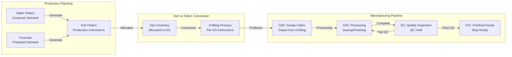

# ERP Data Flow and Mapping Documentation

## Overview
This document provides a comprehensive guide to the data flow and field mappings within the Beverly Knits ERP system. The system integrates multiple data sources to manage textile manufacturing operations from sales to production to inventory management.

## Primary Data Directory Structure
```
/mnt/d/Agent-MCP-1-ddd/Agent-MCP-1-dd/ERP Data/prompts/5/
├── Sales Activity Report.csv              # Sales transactions
├── eFab_Styles_20250814.xlsx             # Master style mapping
├── eFab_SO_List_202508151159-1.csv       # Sales orders (primary)
├── eFab_SO_List_202508151159.csv         # Sales orders (backup)
├── eFab_Inventory_F01_20250814 (1).xlsx  # Finished goods inventory (post-inspection)
├── eFab_Inventory_G00_20250814.xlsx      # Greige goods inventory
├── eFab_Inventory_G02_20250814.xlsx      # Secondary greige inventory
├── eFab_Inventory_I01_20250814.xlsx      # Inspection queue (awaiting QC before F01)
├── eFab_Knit_Orders_20250816.xlsx        # Production orders (yarn → fabric conversion)
├── Style_BOM.csv                          # Bill of Materials (primary)
├── Style_BOM copy.csv                     # Bill of Materials (backup)
├── BOM_Master_Sheet1.csv                  # Master BOM reference
├── QuadS_finishedFabricList_ (2) (1).csv # Fabric specifications
├── Yarn_ID.csv                            # Master yarn database (primary)
├── Yarn_ID_Master.csv                     # Master yarn database (complete)
├── yarn_inventory (2).xlsx                # Current yarn inventory with planning
├── yarn_inventory (3).xlsx                # Yarn inventory backup
├── Yarn_Demand_2025-08-13_0442.xlsx      # Yarn demand forecast
├── Yarn_Demand_By_Style (1).xlsx         # Yarn demand by style breakdown
└── Supplier_ID.csv                        # Supplier master data
```

**Note**: All data files in this directory have been standardized with consistent column headers for seamless integration.

## Header Standardization

### Key Standardizations Applied

1. **Yarn Identifier Standardization**
   - All yarn references now use `Desc#` consistently
   - Previous variations: `Yarn_ID`, `YarnID`, `Yarn ID` → Now: `Desc#`
   - Applies to: Style_BOM.csv, Yarn_ID.csv, yarn_inventory files

2. **Style Reference Standardization**
   - Fabric style: `fStyle#` (consistent across all inventory files)
   - Standard style: `Style#` (consistent across all production files)
   - No more variations like `StyleNo`, `Style_Number`, etc.

3. **Planning Balance Spelling**
   - Note: Currently shows as `Planning_Ballance` in Yarn_ID.csv (with double 'l')
   - Should be verified if this is intentional or needs correction

4. **Standardized Field Names Across Files**
   ```
   Common fields now consistent:
   - Desc# (yarn identifier)
   - Style# (product style)
   - fStyle# (fabric style)
   - BOM_Percent (not BOM%, BOM_Pct, etc.)
   - On_Order (not OnOrder, On Order)
   - Allocated (not Alloc, Reserved)
   ```

## Core Data Flow Diagram

```mermaid
graph TB
    subgraph "Sales Layer"
        SAR[Sales Activity Report.csv]
        SO[eFab_SO_List]
    end
    
    subgraph "Style Mapping Hub"
        STYLES[eFab_Styles_20250814.xlsx<br/>Master Mapping Table]
    end
    
    subgraph "Inventory Layer"
        G00[eFab_Inventory_G00<br/>Greige Stage 1]
        G02[eFab_Inventory_G02<br/>Greige Stage 2]
        I01[eFab_Inventory_I01<br/>Inspection Queue]
        F01[eFab_Inventory_F01<br/>Finished Goods<br/>(Post-QC)]
    end
    
    subgraph "Production Layer"
        BOM[Style_BOM.csv<br/>Bill of Materials]
        FABRIC[QuadS_finishedFabricList]
    end
    
    subgraph "Yarn Layer"
        YARN_ID[Yarn_ID.csv<br/>Master Yarn DB]
        YARN_INV[yarn_inventory.xlsx<br/>Current Stock]
    end
    
    SAR -->|Style#| STYLES
    SO -->|fStyle# & Style#| STYLES
    
    F01 -->|fStyle#| STYLES
    G00 -->|fStyle#| STYLES
    G02 -->|fStyle#| STYLES
    I01 -->|fStyle#| STYLES
    
    STYLES -->|Style#| BOM
    FABRIC -->|Style#| BOM
    BOM -->|Yarn_ID| YARN_ID
    YARN_ID -->|Desc#| YARN_INV
```

## Detailed File Mappings

### 1. Sales Activity Report.csv
**Purpose**: Records all sales transactions and customer orders

| Field | Type | Maps To | Description |
|-------|------|---------|-------------|
| Document | String | Internal ID | Transaction document number |
| Invoice Date | Date | - | Transaction date |
| Customer | String | Customer DB | Customer name |
| **Style#** | String | eFab_Styles.Style# | Product style identifier |
| Yds_ordered | Float | - | Yards ordered |
| UOM | String | - | Unit of measure |
| Unit Price | Currency | - | Price per unit |
| Line Price | Currency | - | Total line amount |
| Sales Rep | String | - | Sales representative |
| PO# | String | - | Purchase order number |

**Key Relationships**:
- `Style#` → `eFab_Styles_20250814.xlsx[Style#]` (primary link to style master)

### 2. eFab_Styles_20250814.xlsx (Master Mapping Hub)
**Purpose**: Central mapping table connecting all style references across the system

| Field | Type | Maps From | Maps To | Description |
|-------|------|-----------|---------|-------------|
| **fStyle#** | String | All Inventory Files | - | Fabric style code |
| **Style#** | String | Sales Activity Report | Style_BOM | Standard style code |
| Description | String | - | - | Style description |
| Category | String | - | - | Product category |
| Status | String | - | - | Active/Inactive |

**Critical Mappings**:
- `fStyle#` ← All inventory files (F01, G00, G02, I01)
- `Style#` → `Style_BOM.csv[Style#]`
- `Style#` ← `Sales Activity Report.csv[Style#]`
- Both `fStyle#` and `Style#` → `eFab_SO_List[fStyle#, Style#]`

### 3. eFab_SO_List_202508151159-1.csv
**Purpose**: Active sales orders with fulfillment status

| Field | Type | Maps To | Description |
|-------|------|---------|-------------|
| Status | String | - | Order status (Open/Picked/Shipped) |
| SO # | String | - | Sales order number |
| **fStyle#** | String | eFab_Styles.fStyle# | Fabric style reference |
| **Style#** | String | eFab_Styles.Style# | Standard style reference |
| UOM | String | - | Unit of measure |
| Ordered | Float | - | Quantity ordered |
| Picked/Shipped | Float | - | Quantity fulfilled |
| Balance | Float | - | Remaining quantity |
| Available | Float | Inventory files | Available inventory |
| Customer | String | Customer DB | Customer name |
| Ship Date | Date | - | Scheduled ship date |

**Dual Mapping Feature**:
- Contains BOTH `fStyle#` and `Style#` for cross-reference validation
- Links orders to both inventory (`fStyle#`) and production (`Style#`)

### 4. Inventory Files (F01, G00, G02, I01)
**Purpose**: Track inventory at different production stages

#### Common Structure:
| Field | Type | Maps To | Description |
|-------|------|---------|-------------|
| **fStyle#** | String | eFab_Styles.fStyle# | Fabric style code |
| Description | String | - | Item description |
| Quantity | Float | - | Current quantity |
| Location | String | - | Warehouse location |
| Status | String | - | Inventory status |
| Last Updated | DateTime | - | Last inventory update |

#### Stage Definitions (Production Flow):
1. **G00**: Primary greige (unfinished) goods - raw fabric stage
2. **G02**: Secondary greige inventory - additional processing stage
3. **I01**: Inspection queue - fabric awaiting quality control inspection
4. **F01**: Finished goods - passed QC and ready for shipment

**Production Flow**: G00 → G02 → I01 (QC inspection) → F01 (approved inventory)

**Mapping Flow**:
```
Inventory[fStyle#] → eFab_Styles[fStyle#] → eFab_Styles[Style#] → Style_BOM[Style#]
```

### 5. Style_BOM.csv (Standardized Headers)
**Purpose**: Bill of Materials defining yarn requirements for each style

| Field | Type | Maps From | Maps To | Description |
|-------|------|-----------|---------|-------------|
| **Style#** | String | eFab_Styles.Style# | - | Product style |
| **Desc#** | Integer | - | Yarn_ID.csv.Desc# | Yarn identifier (standardized from Yarn_ID) |
| BOM_Percent | Float | - | - | Percentage of yarn in product |
| unit | String | - | - | Unit of measure (lbs/yds) |

**Key Relationships**:
- `Style#` ← `eFab_Styles[Style#]`
- `Desc#` → `Yarn_ID.csv[Desc#]` (direct match with standardized header)

### 6. QuadS_finishedFabricList_(2)(1).csv
**Purpose**: Fabric specifications and technical details

| Field | Type | Maps To | Description |
|-------|------|---------|-------------|
| F ID | Integer | - | Fabric ID |
| **Style#** | String | Style_BOM.Style# | Style identifier |
| Finish Code | String | - | Finishing process code |
| Overall Width | Float | - | Total fabric width |
| Cuttable Width | Float | - | Usable fabric width |
| Oz/Lin Yd | Float | - | Weight per linear yard |
| Yds/Lbs | Float | - | Yards per pound conversion |
| GSM | Float | - | Grams per square meter |

**Integration Point**:
- Links fabric specifications to BOM for yarn requirement calculations

### 7. eFab_Knit_Orders_20250816.xlsx
**Purpose**: Production orders that convert yarn into greige fabric

| Field | Type | Maps To | Description |
|-------|------|---------|-------------|
| **Actions** | String | - | Knit Order ID (e.g., K2508058) |
| **Style#** | String | eFab_Styles.Style# | Product style |
| Order # | String | - | Display order number |
| Start Date | Date | - | Production start date |
| Quoted Date | Date | - | Expected completion |
| Qty Ordered (lbs) | Float | - | Target production quantity |
| G00 (lbs) | Float | G00 inventory | Fabric produced and in G00 |
| Shipped (lbs) | Float | - | Quantity already shipped |
| Balance (lbs) | Float | - | Remaining to produce |
| Seconds (lbs) | Float | - | Quality rejects |
| Machine | String | - | Assigned knitting machine |
| PO# | String | SO List | Related purchase order |

**Key Relationships**:
- `Style#` → `Style_BOM[Style#]` → `Yarn requirements`
- Yarn allocation = Style BOM × Qty Ordered
- Creates allocated demand in yarn inventory

**Balance Calculation**:
```
Balance = Qty Ordered - (G00 + Shipped + Seconds)
```

### 8. Yarn_ID.csv
**Purpose**: Master yarn database with supplier and specification details

| Field | Type | Maps From | Description |
|-------|------|-----------|-------------|
| **Desc#** | Integer | Style_BOM.Yarn_ID | Yarn identifier |
| Supplier | String | - | Supplier name |
| Description | String | - | Yarn description (count/blend) |
| Blend | String | - | Material composition |
| Type | String | - | Yarn type |
| Color | String | - | Yarn color |
| On_Order | Float | - | Quantity on order |
| Allocated | Float | - | Quantity allocated |
| Planning_Balance | Float | - | Planning balance |
| Cost_Pound | Currency | - | Cost per pound |

**Critical Fields for Planning**:
- `Planning_Balance` = Theoretical Balance - Allocated + On_Order
- Negative Planning_Balance indicates shortage

### 8. yarn_inventory (2).xlsx
**Purpose**: Current yarn inventory with planning calculations

| Field | Type | Links To | Description |
|-------|------|----------|-------------|
| Desc# | Integer | Yarn_ID.Desc# | Yarn identifier |
| Description | String | - | Yarn description |
| Theoretical Balance | Float | - | Calculated available |
| Allocated | Float | - | Reserved for orders |
| On Order | Float | - | Incoming shipments |
| **Planning Balance** | Float | - | Key planning metric |
| Consumed | Float | - | Historical consumption |
| Weeks of Supply | Float | - | Inventory coverage |

## Production Pipeline Flow



### Production Order Flow
1. **Knit Orders (KO)** are created from:
   - Sales Orders (actual customer demand)
   - Forecasted demand (anticipated needs)

2. **Yarn Allocation**:
   - When KO is created, yarn is allocated based on Style BOM
   - Allocated yarn appears in yarn inventory "Allocated" column
   - Planning Balance = Theoretical + On_Order - Allocated

3. **Production Tracking**:
   - KO Balance (lbs) = Qty Ordered - (G00 + Shipped + Seconds)
   - Negative balance indicates overproduction

### Quality Control Gates
- **I01 → F01**: Only items passing quality inspection move to finished goods
- **I01 → G02**: Failed items return for rework/reprocessing
- **F01**: Only contains QC-approved inventory ready for customer shipment

## Data Processing Workflows

### 1. Sales to Production Flow
```
1. Sales Activity Report[Style#]
   ↓
2. eFab_Styles[Style#] → [fStyle#]
   ↓
3. Check Inventory (F01, G00, G02, I01) via [fStyle#]
   ↓
4. If insufficient inventory:
   - Style_BOM[Style#] → [Yarn_ID]
   - Check Yarn_ID[Planning_Balance]
   - Calculate yarn requirements
```

### 2. Inventory Analysis Flow
```
1. Load all inventory files by stage:
   - G00, G02 (in-process)
   - I01 (awaiting inspection)
   - F01 (available to ship)
   ↓
2. Map [fStyle#] → eFab_Styles → [Style#]
   ↓
3. Aggregate by Style# with stage awareness:
   - Available now: F01 only
   - Available pending QC: I01
   - In production: G00 + G02
   ↓
4. Compare with eFab_SO_List[Balance]
   ↓
5. Generate shortage/surplus reports with QC status
```

### 3. Yarn Requirement Calculation (Using Standardized Headers)
```
1. eFab_SO_List[Style#, Ordered]
   ↓
2. Style_BOM[Style#] → [Desc#, BOM_Percent]
   ↓
3. QuadS_finishedFabricList[Style#] → [Yds/Lbs conversion]
   ↓
4. Calculate: Yarn_Required = Ordered × BOM_Percent × Conversion_Factor
   ↓
5. Compare with Yarn_ID[Desc#, Planning_Ballance]
```

### 4. Yarn Allocation and Shortage Analysis
```
1. Load Knit Orders[Style#, Qty Ordered (lbs)]
   ↓
2. For each KO: Style_BOM[Style#] → Yarn requirements
   ↓
3. Sum all yarn allocations by Desc#
   ↓
4. Update Yarn Inventory:
   - Allocated = Sum of KO yarn requirements
   - Planning_Balance = Theoretical + On_Order - Allocated
   ↓
5. Identify shortages:
   - If Planning_Balance < 0: SHORTAGE
   - Check for substitute yarns
   - Generate procurement recommendations
```

### 5. Revised 6-Phase Planning Flow
```
Phase 1: Demand Consolidation
   - Sales Orders (priority 1)
   - Consistent pattern forecasts (priority 2)
   ↓
Phase 2: Inventory Assessment (Multi-level)
   - F01 (immediate availability)
   - I01 (2 days - pending QC)
   - G00/G02 (30 days - in process)
   - Active KO balance (45 days)
   ↓
Phase 3: Net Requirements Calculation
   - Net = Demand - All Available Inventory
   - Time-phased netting by availability date
   ↓
Phase 4: BOM Explosion (Net requirements only)
   - Only explode what needs to be produced
   - Calculate yarn requirements
   ↓
Phase 5: Procurement & Production Planning
   - Generate KO recommendations
   - Yarn procurement plan with priorities
   - Allocation status (Hard/Soft/Available)
   ↓
Phase 6: Optimization & Output
   - Consolidated recommendations
   - Management reports
```

## Unit Conversion: Pounds ↔ Yards

### Conversion Requirements
Different stages of production use different units:
- **Knit Orders**: Pounds (lbs) - yarn consumption and fabric production
- **Sales Orders**: Yards (yds) - customer ordering unit
- **Inventory G00, G02**: Pounds (lbs) - fabric weight tracking
- **Inventory F01**: May be tracked in both units

### Conversion Source: QuadS_finishedFabricList
The fabric specifications file provides conversion factors:

| Field | Purpose |
|-------|---------|
| Style# | Links to product style |
| Yds/Lbs | **Key conversion factor** |
| Overall Width | Total fabric width |
| Cuttable Width | Usable width |
| Oz/Lin Yd | Weight per linear yard |
| GSM | Grams per square meter |

### Conversion Formulas
```python
# Using QuadS data for style
yards = pounds * fabric_spec['Yds/Lbs']
pounds = yards / fabric_spec['Yds/Lbs']

# Example: If Yds/Lbs = 1.581 for style 6191-BK
# 100 lbs = 100 * 1.581 = 158.1 yards
# 100 yards = 100 / 1.581 = 63.25 lbs
```

### Application in Planning
1. **Sales Order (yards) → Knit Order (lbs)**:
   - Convert customer order from yards to pounds for production
   
2. **G00 Inventory (lbs) → Available for Sales (yards)**:
   - Convert greige inventory to yards for order fulfillment

3. **Yarn Requirements**:
   - Always calculated in pounds (from BOM)
   - Knit Orders already in pounds, no conversion needed

## Critical Integration Points

### 1. fStyle# ↔ Style# Mapping
- **File**: eFab_Styles_20250814.xlsx
- **Importance**: Central hub connecting inventory (fStyle#) to production (Style#)
- **Validation**: Check for unmapped styles in both directions

### 2. Yarn Planning Balance
- **Formula**: `Planning Balance = Theoretical Balance - Allocated + On Order`
- **Critical Threshold**: Planning Balance < 0 indicates shortage
- **Action**: Trigger procurement or substitution analysis

### 3. Multi-Stage Inventory Aggregation
- **Stages**: F01 (Finished) + G00 (Greige1) + G02 (Greige2) + I01 (WIP)
- **Aggregation Key**: fStyle# → Style# mapping
- **Purpose**: Total available inventory across production pipeline

## Data Quality Checks

### Required Validations
1. **Style Mapping Completeness**
   ```python
   # All fStyle# in inventory files must exist in eFab_Styles
   # All Style# in Sales/BOM must exist in eFab_Styles
   ```

2. **BOM Percentage Validation**
   ```python
   # Sum of BOM_Percent for each Style# should equal 100%
   ```

3. **Inventory Consistency**
   ```python
   # Available in SO_List should match aggregated inventory
   ```

4. **Yarn Balance Verification**
   ```python
   # Planning Balance = Theoretical - Allocated + On_Order
   ```

## Common Data Issues and Solutions

### Issue 1: Unmapped Styles
- **Symptom**: fStyle# in inventory has no Style# mapping
- **Solution**: Update eFab_Styles master mapping file

### Issue 2: Missing BOM Entries
- **Symptom**: Style# exists but no yarn requirements defined
- **Solution**: Add Style# entries to Style_BOM.csv

### Issue 3: Negative Planning Balance
- **Symptom**: Yarn shortage detected
- **Solution**: 
  1. Check for substitutable yarns
  2. Generate procurement recommendation
  3. Adjust production schedule

### Issue 4: Data Type Mismatches
- **Symptom**: Join failures between files
- **Solution**: Ensure consistent data types (string vs numeric) for key fields

## API Integration Points

### Key Endpoints Using These Mappings
```
GET /api/yarn-intelligence
- Uses: Yarn_ID.csv, yarn_inventory.xlsx
- Returns: Shortage analysis with substitutions

GET /api/inventory-intelligence-enhanced  
- Uses: All inventory files + eFab_Styles mapping
- Returns: Aggregated inventory by Style#

POST /api/fabric/yarn-requirements
- Uses: Style_BOM.csv, QuadS_finishedFabricList
- Returns: Yarn requirements for given styles

GET /api/six-phase-planning
- Uses: Complete data flow from sales to yarn
- Returns: Optimized production plan
```

## Performance Optimization Tips

1. **Cache Style Mappings**
   - eFab_Styles mapping used frequently
   - Load once and cache in memory

2. **Batch Process Inventory Files**
   - Process F01, G00, G02, I01 in parallel
   - Aggregate results after loading

3. **Index Key Fields**
   - Create indexes on: fStyle#, Style#, Yarn_ID
   - Speeds up joins and lookups

4. **Incremental Updates**
   - Track last_modified timestamps
   - Only reprocess changed data

## Data Refresh Schedule

| Data Source | Update Frequency | Critical For |
|-------------|-----------------|--------------|
| Sales Activity Report | Daily | Demand planning |
| eFab_SO_List | Real-time | Order fulfillment |
| Inventory Files | 4x daily | Stock availability |
| Style_BOM | Weekly | Production planning |
| Yarn_ID | On change | Master data |
| yarn_inventory | Hourly | Shortage detection |

## Troubleshooting Guide

### Debugging Data Flow Issues

1. **Verify File Existence**
   ```bash
   ls -la "/mnt/d/Agent-MCP-1-ddd/Agent-MCP-1-dd/ERP Data/prompts/5/"
   ```

2. **Check Style Mapping**
   ```python
   # Verify fStyle# to Style# mapping
   styles_df = pd.read_excel('eFab_Styles_20250814.xlsx')
   unmapped = inventory_df[~inventory_df['fStyle#'].isin(styles_df['fStyle#'])]
   ```

3. **Validate BOM Coverage (with standardized Desc#)**
   ```python
   # Check which styles have BOM entries
   bom_df = pd.read_csv('Style_BOM.csv')
   bom_styles = bom_df['Style#'].unique()
   sales_styles = sales_df['Style#'].unique()
   missing_bom = set(sales_styles) - set(bom_styles)
   
   # Verify yarn references use Desc#
   yarn_refs = bom_df['Desc#'].dropna().unique()
   ```

4. **Verify Yarn Planning Balance (note spelling)**
   ```python
   # Recalculate planning balance (note: Planning_Ballance with double 'l')
   yarn_df = pd.read_csv('Yarn_ID.csv')
   yarn_df['Calculated_Balance'] = (
       yarn_df['Theoretical Balance'] - 
       yarn_df['Allocated'] + 
       yarn_df['On_Order']  # Standardized with underscore
   )
   discrepancies = yarn_df[
       yarn_df['Calculated_Balance'] != yarn_df['Planning_Ballance']  # Note spelling
   ]
   ```

## Future Enhancement Opportunities

1. **Real-time Data Synchronization**
   - Implement CDC (Change Data Capture)
   - Stream updates instead of batch processing

2. **Data Lineage Tracking**
   - Track data transformations
   - Maintain audit trail

3. **Automated Validation Rules**
   - Implement schema validation
   - Auto-correct common issues

4. **Machine Learning Integration**
   - Predict style-to-yarn mappings
   - Anomaly detection in data flow