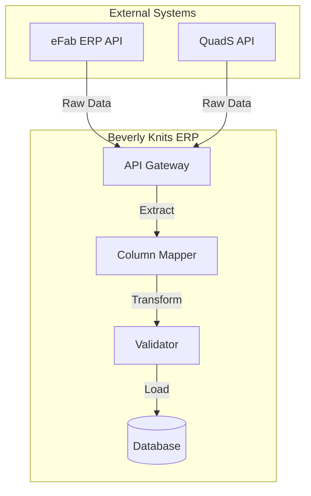

# Beverly Knits ERP v2 - Consolidated Data Mapping Reference

## Executive Summary

This document consolidates all data mapping configurations from the Beverly Knits ERP v2 system, providing a complete reference for column mappings, data transformations, and integration patterns between eFab, QuadS, and internal systems.

---

## 1. SYSTEM ARCHITECTURE

### API-Based Data Integration

```
┌─────────────────────────────────────────────────────────┐
│                    Data Sources                         │
├──────────────────────┬──────────────────────────────────┤
│      eFab ERP        │         QuadS System             │
│ (efab.bkiapps.com)   │    (quads.bkiapps.com)          │
├──────────────────────┴──────────────────────────────────┤
│                    Beverly Knits ERP                    │
│              API Integration Layer (v2)                 │
├──────────────────────────────────────────────────────────┤
│              Data Processing Engine                     │
│  • Column Mapping  • Validation  • Transformation       │
├──────────────────────────────────────────────────────────┤
│              Standardized Database                      │
│     PostgreSQL with Consistent Column Schema            │
└──────────────────────────────────────────────────────────┘
```

### Data Flow Architecture



---

## 2. COMPREHENSIVE COLUMN MAPPINGS

### 2.1 Style/Fabric Identifier Mappings

| API Endpoint                    | Source Column             | Target Column             | Data Type   | Transformation  |
| ------------------------------- | ------------------------- | ------------------------- | ----------- | --------------- |
| `/api/sales-order/plan/list`  | `cFVersion` + `fBase` | `cFVersion` + `fBase` | VARCHAR     | Composite key   |
| `/api/knitorder/list`         | `Style #`               | `Style#`                | VARCHAR(50) | Remove spaces   |
| `/api/finished/i01`           | `Style #`               | `Style#`                | VARCHAR(50) | Remove spaces   |
| `/api/greige/g00`             | `Style #`               | `Style#`                | VARCHAR(50) | Remove spaces   |
| `/api/greige/g02`             | `fStyle`                | `fStyle#`               | VARCHAR(50) | Add # suffix    |
| `/api/finished/f01`           | `Style #`               | `Style#`                | VARCHAR(50) | Remove spaces   |
| `/api/styles/greige/active`   | `Style#`                | `Style#`                | VARCHAR(50) | Direct mapping  |
| `/api/styles/finished/active` | `Style#`                | `Style#`                | VARCHAR(50) | Direct mapping  |
| `/api/styles`                 | `Style`                 | `cFVersion`             | VARCHAR(50) | Special mapping |

### 2.2 Yarn Identifier Mappings

| API Endpoint                   | Source Column | Target Column | Data Type   | Transformation |
| ------------------------------ | ------------- | ------------- | ----------- | -------------- |
| `/api/yarn/active`           | `Desc#`     | `Desc#`     | VARCHAR(50) | Direct mapping |
| `/api/report/yarn_expected`  | `Desc`      | `Desc#`     | VARCHAR(50) | Add # suffix   |
| `/api/report/yarn_demand`    | `Yarn`      | `Desc#`     | VARCHAR(50) | Column rename  |
| `/api/report/yarn_demand_ko` | `Yarn`      | `Desc#`     | VARCHAR(50) | Column rename  |
| BOM Files                      | `Yarn_ID`   | `Desc#`     | VARCHAR(50) | Standardize    |

### 2.3 Inventory Stage Mappings

| Stage Code    | Location       | API Endpoint          | Description                 |
| ------------- | -------------- | --------------------- | --------------------------- |
| **G00** | Greige Stage 1 | `/api/greige/g00`   | Raw fabric, initial greige  |
| **G02** | Greige Stage 2 | `/api/greige/g02`   | Secondary greige processing |
| **I01** | QC/Inspection  | `/api/finished/i01` | Quality control queue       |
| **F01** | Finished Goods | `/api/finished/f01` | Post-QC approved inventory  |

**Production Flow**: G00 → G02 → I01 (Inspection) → F01 (Finished)

### 2.4 Common Field Standardizations

| Original Variations                        | Standardized Column  | Data Type     |
| ------------------------------------------ | -------------------- | ------------- |
| `Planning Balance`, `Planning_Balance` | `Planning_Balance` | DECIMAL(15,2) |
| `On Order`, `On-Order`, `OnOrder`    | `On_Order`         | DECIMAL(15,2) |
| `Allocated`, `Alloc`, `Reserved`     | `Allocated`        | DECIMAL(15,2) |
| `BOM%`, `BOM_Pct`, `BOM Percent`     | `BOM_Percent`      | DECIMAL(5,2)  |
| `Yds_ordered`, `Yards Ordered`         | `Yds_ordered`      | DECIMAL(15,2) |
| `Unit Price`, `UnitPrice`              | `Unit_Price`       | DECIMAL(15,2) |

---

## 3. DATA TRANSFORMATION RULES

### 3.1 Data Type Conversions

| Source Type     | Target Type              | Transformation Rule          |
| --------------- | ------------------------ | ---------------------------- |
| String Dates    | TIMESTAMP WITH TIME ZONE | Parse ISO 8601 → UTC        |
| Currency Values | DECIMAL(15,2)            | Remove $, commas → round(2) |
| Quantities      | DECIMAL(15,2)            | Remove commas → round(3)    |
| Percentages     | DECIMAL(5,2)             | If <1: ×100, else direct    |
| Boolean Strings | BOOLEAN                  | 'true'/'yes'/'1' → TRUE     |

### 3.2 Unit Conversions

| From         | To      | Formula     | Example                |
| ------------ | ------- | ----------- | ---------------------- |
| LBS (pounds) | KG      | × 0.453592 | 100 LBS = 45.36 KG     |
| Yards        | Meters  | × 0.9144   | 100 YDS = 91.44 M      |
| Inches       | CM      | × 2.54     | 60" = 152.4 CM         |
| GSM          | oz/yd² | × 0.0295   | 180 GSM = 5.31 oz/yd² |

### 3.3 Business Logic Calculations

```sql
-- Planning Balance Calculation
Planning_Balance = On_Hand - Allocated + On_Order

-- Yarn Demand Calculation
Total_Demand = SUM(Production_Orders × BOM_Percent)

-- Machine Utilization
Utilization_Percent = (Actual_Hours / Available_Hours) × 100

-- Order Fulfillment Rate
Fulfillment_Rate = (Quantity_Shipped / Quantity_Ordered) × 100
```

---

## 4. CRITICAL DATA RELATIONSHIPS

### 4.1 Style Flow Hierarchy

```
Sales Order (cFVersion)
    ↓
SO List (cFVersion + fBase)
    ↓
Production Order (Style#)
    ↓
Inventory Stages (Style# or fStyle#)
    ├── G00: Style#
    ├── G02: fStyle#
    ├── I01: Style#
    └── F01: Style#
```

### 4.2 Yarn Flow Hierarchy

```
BOM Definition (Desc#)
    ↓
Yarn Inventory (Desc#)
    ↓
Demand Reports (Yarn → Desc#)
    ↓
Purchase Orders (Desc#)
```

### 4.3 Work Center Mappings

| Work Center Code | Department       | Machine Type      |
| ---------------- | ---------------- | ----------------- |
| 9.38.20.F        | Knitting Dept 1  | Circular Knitting |
| 9.38.21.F        | Knitting Dept 2  | Flat Knitting     |
| 10.40.01.D       | Dyeing Dept 1    | Jet Dyeing        |
| 11.42.01.F       | Finishing Dept 1 | Stenter Frame     |

---

## 5. VALIDATION RULES

### 5.1 Required Fields by Entity

| Entity Type      | Required Fields                                               | Validation         |
| ---------------- | ------------------------------------------------------------- | ------------------ |
| Sales Order      | `order_number`, `customer_id`, `order_date`, `Style#` | NOT NULL           |
| Production Order | `order_number`, `Style#`, `quantity`, `machine_id`    | NOT NULL           |
| Yarn Inventory   | `Desc#`, `On_Hand`, `Planning_Balance`                  | NOT NULL           |
| BOM Entry        | `Style#`, `Desc#`, `BOM_Percent`                        | NOT NULL, SUM=100% |

### 5.2 Data Quality Checks

```python
# Pattern Validation
VALIDATION_PATTERNS = {
    'order_number': r'^[A-Z0-9\-]+$',      # SO2025001
    'Style#': r'^[A-Z0-9\-]+$',            # ABC123001-12
    'Desc#': r'^[A-Z0-9]+$',               # 12345
    'machine_code': r'^M\d{3}$',           # M161
    'work_center': r'^\d+\.\d+\.\d+\.[A-Z]$'  # 9.38.20.F
}

# Range Validation
RANGE_CHECKS = {
    'quantity': {'min': 0, 'max': 999999},
    'BOM_Percent': {'min': 0, 'max': 100},
    'Planning_Balance': {'min': -999999, 'max': 999999},
    'Unit_Price': {'min': 0, 'max': 9999999.99}
}
```

---

## 6. API INTEGRATION DETAILS

### 6.1 Authentication & Session Management

```bash
# eFab Session Configuration
EFAB_SESSION="aMdcwNLa0ov0pcbWcQ_zb5wyPLSkYF_B"
SESSION_COOKIE_NAME="dancer.session"

# Session Validation
curl -H "Cookie: dancer.session=$EFAB_SESSION" \
     https://efab.bkiapps.com/api/test

# Auto-refresh Configuration
SESSION_REFRESH_INTERVAL=3600  # seconds
SESSION_MAX_AGE=86400          # 24 hours
```

### 6.2 API Response Caching

| Data Type      | Cache TTL  | Refresh Strategy        |
| -------------- | ---------- | ----------------------- |
| Sales Orders   | 30 minutes | On-demand + scheduled   |
| Yarn Inventory | 30 minutes | Real-time + cache       |
| Style Masters  | 60 minutes | Daily refresh           |
| Machine Status | 5 minutes  | Real-time polling       |
| ML Forecasts   | 4 hours    | Scheduled recalculation |

### 6.3 Error Handling & Fallback

```python
# Error Code Mappings
ERROR_MAPPINGS = {
    'SESSION_EXPIRED': 'Renew eFab session cookie',
    'CONNECTION_FAILED': 'Retry with exponential backoff',
    'DATA_NOT_FOUND': 'Use cached data if available',
    'INVALID_RESPONSE': 'Log error, skip record',
    'RATE_LIMITED': 'Implement request throttling'
}

# Retry Strategy
RETRY_CONFIG = {
    'max_attempts': 3,
    'initial_delay': 1,  # seconds
    'backoff_factor': 2,
    'max_delay': 30
}
```

---

## 7. DYNAMIC COLUMN RESOLUTION

### 7.1 Column Alias System

```python
# Flexible Column Mapping
COLUMN_ALIASES = {
    'style': [
        'Style#', 'Style #', 'Style Number',
        'StyleNumber', 'style_number', 'fStyle'
    ],
    'yarn': [
        'Desc#', 'Desc','Yarn_ID', 'YarnID',
        'Yarn ID', 'Yarn'
    ],
    'quantity': [
        'Qty', 'Quantity', 'Amount',
        'Volume', 'Pieces', 'Units'
    ],
    'price': [
        'Unit_Price', 'UnitPrice', 'Cost',
        'Rate', 'Price', 'Value'
    ],
    'order': [
        'order_id', 'order_number', 'order_no',
        'so_number', 'po_number', 'Order #'
    ]
}

def resolve_column(df, target_column):
    """Dynamically resolve column name from aliases."""
    if target_column in df.columns:
        return target_column

    for alias_group in COLUMN_ALIASES.get(target_column.lower(), []):
        for alias in alias_group:
            if alias in df.columns:
                return alias

    return None
```

### 7.2 Processing Pipeline

```python
# Data Processing Order
PROCESSING_PIPELINE = [
    'extract_raw_data',        # API get
    'apply_column_mappings',   # Map to standard names
    'validate_data_types',     # Type conversion
    'apply_transformations',   # Business logic
    'validate_business_rules', # Constraint checks
    'load_to_database'        # Final storage
]
```

---

## 8. AUTOMATED SCHEDULERS

### 8.1 Yarn Demand Scheduler

```bash
# Configuration
ENABLE_YARN_SCHEDULER=true
SCHEDULER_TIMES="10:00,12:00"  # Daily at 10 AM and 12 PM
FILTER_NONPRODUCTION_YARNS=true

# Manual Trigger
curl -X POST http://localhost:5006/api/manual-yarn-refresh

# Check Status
curl http://localhost:5006/api/comprehensive-kpis | jq '.scheduler_status'
```

### 8.2 Data Refresh Schedule

| Data Type         | Refresh Frequency | Method      |
| ----------------- | ----------------- | ----------- |
| Sales Orders      | Every 30 min      | API poll    |
| Yarn Inventory    | Every 30 min      | API poll    |
| Production Orders | Every 15 min      | API poll    |
| Style Masters     | Daily at 2 AM     | Bulk sync   |
| ML Forecasts      | Every 4 hours     | Recalculate |

---

## 9. MONITORING & QUALITY METRICS

### 9.1 Data Quality KPIs

```sql
-- Data Completeness
SELECT
    COUNT(*) as total_records,
    SUM(CASE WHEN Style# IS NULL THEN 1 ELSE 0 END) as missing_style,
    SUM(CASE WHEN Desc# IS NULL THEN 1 ELSE 0 END) as missing_yarn,
    (COUNT(*) - COUNT(NULLIF(Style#, ''))) * 100.0 / COUNT(*) as incompleteness_rate
FROM production_orders;

-- Mapping Success Rate
SELECT
    mapping_type,
    successful_mappings,
    failed_mappings,
    (successful_mappings * 100.0 /
     (successful_mappings + failed_mappings)) as success_rate
FROM mapping_metrics;
```

### 9.2 Performance Metrics

| Metric               | Target  | Alert Threshold |
| -------------------- | ------- | --------------- |
| API Response Time    | <500ms  | >1000ms         |
| Mapping Success Rate | >99%    | <95%            |
| Data Freshness       | <30 min | >60 min         |
| Cache Hit Rate       | >80%    | <60%            |
| Validation Pass Rate | >98%    | <90%            |

---

## 10. TROUBLESHOOTING GUIDE

### 10.1 Common Mapping Issues

| Issue          | Symptom                     | Solution                                  |
| -------------- | --------------------------- | ----------------------------------------- |
| Missing Style# | NULL values in production   | Check column aliases, verify API response |
| Yarn mismatch  | BOM lookup fails            | Ensure Desc# standardization              |
| Wrong stage    | Inventory in wrong location | Verify G00/G02/I01/F01 mapping            |
| Date parsing   | Invalid timestamps          | Check date format patterns                |

### 10.2 Debugging Queries

```sql
-- Check unmapped styles
SELECT DISTINCT Style#
FROM production_orders
WHERE Style# NOT IN (SELECT Style# FROM style_master);

-- Verify yarn mappings
SELECT
    y.Desc# as yarn_id,
    b.Style# as style,
    b.BOM_Percent,
    y.Planning_Balance
FROM bom b
LEFT JOIN yarn_inventory y ON b.Desc# = y.Desc#
WHERE y.Desc# IS NULL;

-- Audit mapping failures
SELECT
    timestamp,
    source_table,
    source_column,
    target_column,
    error_message
FROM mapping_audit_log
WHERE status = 'failed'
ORDER BY timestamp DESC
LIMIT 100;
```

---

## 11. VERSION HISTORY

| Version | Date       | Changes                                             |
| ------- | ---------- | --------------------------------------------------- |
| 2.0.0   | 2025-01-21 | Complete consolidation of all mapping documentation |
| 1.9.0   | 2024-09-15 | Added QuadS integration mappings                    |
| 1.8.0   | 2024-08-01 | Implemented dynamic column resolution               |
| 1.7.0   | 2024-07-01 | Added yarn scheduler automation                     |
| 1.0.0   | 2024-01-01 | Initial mapping configuration                       |

---

## 12. APPENDIX

### A. Complete Column List

```python
# All standardized columns in the system
STANDARD_COLUMNS = {
    # Style/Fabric Identifiers
    'Style#',           # Primary style identifier
    'fStyle#',          # Fabric style variant
    'fBase',            # Fabric base code
    'cFVersion',        # Fabric version code

    # Yarn Identifiers
    'Desc#', 'Desc',    # Universal yarn ID
    'Yarn_Color',       # Yarn color attribute
    'Yarn_Type',        # Yarn type classification
    'Yarn_Count',       # Yarn count specification
    'Yarn_Supplier',    # Yarn supplier reference

    # Inventory Metrics
    'On_Hand',          # Current inventory
    'Allocated',        # Reserved quantity
    'On_Order',         # Incoming quantity
    'Planning_Balance', # Calculated net position

    # Production Fields
    'BOM_Percent',      # Bill of materials percentage
    'Machine_Code',     # Machine identifier
    'Work_Center',      # Work center location
    'Order_Status',     # Order status code

    # Common Fields
    'Quantity',         # Generic quantity field
    'Unit_Price',       # Price per unit
    'Total_Amount',     # Calculated total
    'Created_Date',     # Record creation timestamp
    'Updated_Date'      # Last modification timestamp
}
```

### B. API Endpoint Summary

```yaml
eFab_Endpoints:
  - /api/sales-order/plan/list
  - /api/knitorder/list
  - /api/yarn/active
  - /api/styles
  - /api/report/yarn_demand
  - /api/report/yarn_demand_ko
  - /api/yarn-po
  - /api/report/yarn_expected
  - /api/greige/g00
  - /api/greige/g02
  - /api/finished/i01
  - /api/finished/f01

QuadS_Endpoints:
  - /api/styles/greige/active
  - /api/styles/finished/active
  
```

---

**Document Version**: 2.0.0
**Last Updated**: 2025-01-21
**Status**: Production - Complete Consolidated Mapping Reference
**Maintained By**: Beverly Knits ERP Development Team
