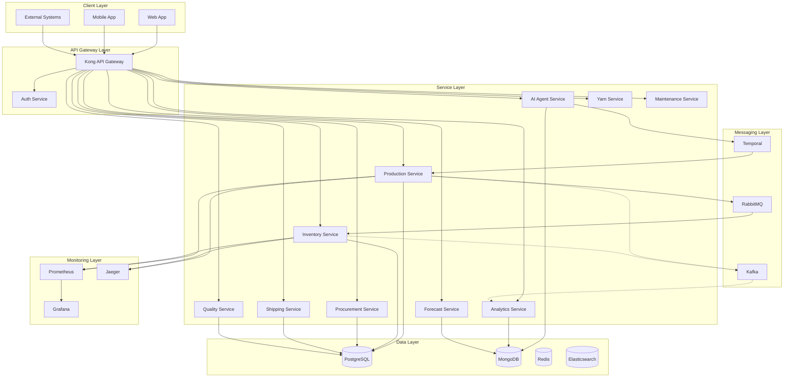
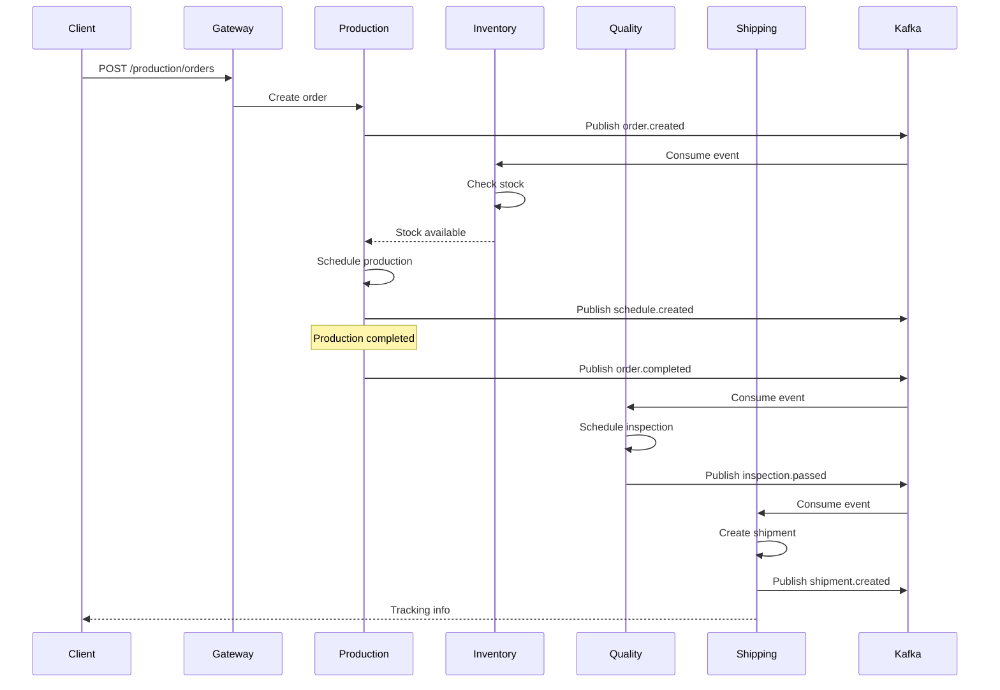
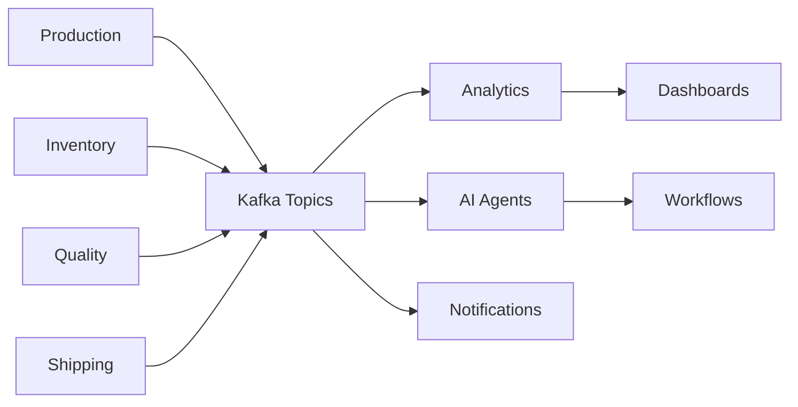
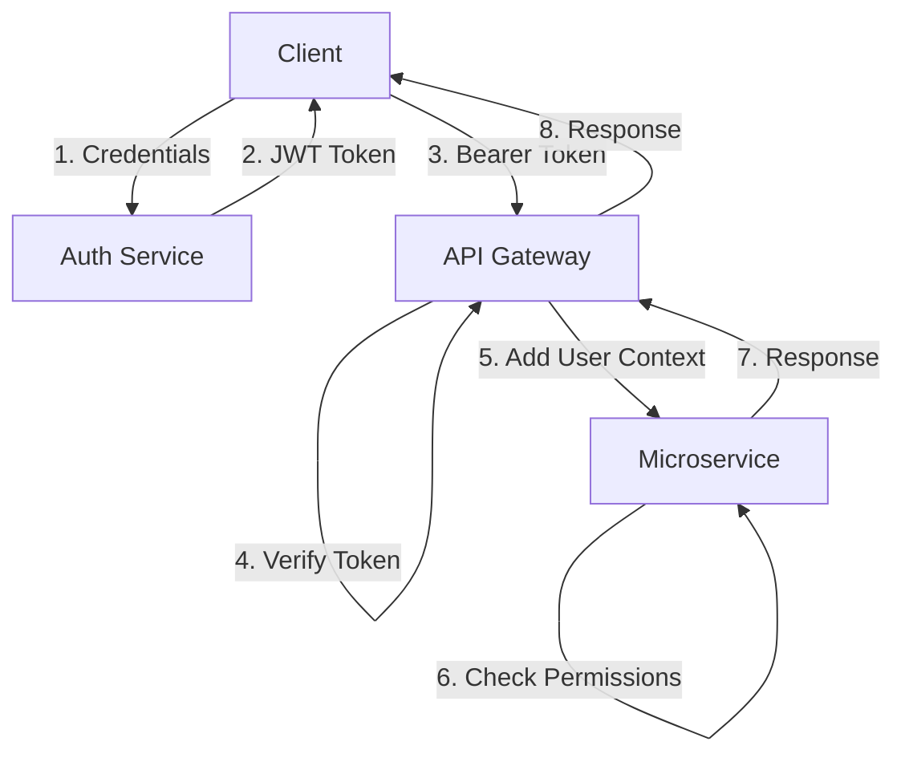

# System Architecture Overview

**Created**: 2025-10-03
**Last Updated**: 2025-10-03

Comprehensive architecture documentation for Beverly Knits ERP v3.0.

## Executive Summary

Beverly Knits ERP is a cloud-native, event-driven microservices platform designed for textile manufacturing operations. The system processes 10,000+ daily transactions across production, inventory, quality, and logistics with 99.9% uptime.

**Key Metrics:**
- **10 Microservices**: Specialized, independently deployable services
- **195+ API Endpoints**: Complete REST API coverage
- **< 200ms**: Average API response time
- **99.9%**: System uptime SLA
- **10,000+**: Daily transactions

---

## Architecture Principles

### 1. Microservices Architecture

Each service is independently deployable with:
- Single responsibility
- Autonomous database
- API-first design
- Event-driven communication

### 2. Event-Driven Design

Services communicate via:
- **Events** (Kafka): State changes, notifications
- **Commands** (RabbitMQ): Direct actions, synchronous operations
- **REST APIs**: Query operations, external integrations

### 3. Cloud-Native

Built for Kubernetes deployment:
- Container-based (Docker)
- Horizontal scaling
- Self-healing
- Rolling updates

### 4. Polyglot Persistence

Right database for each service:
- **PostgreSQL**: Transactional data (Production, Inventory, Procurement)
- **MongoDB**: Document storage (AI Agents, Analytics)
- **Redis**: Caching, sessions
- **Elasticsearch**: Full-text search, logs

---

## System Architecture Diagram



---

## Microservices Overview

### 1. Production Service (Port 5001)

**Responsibility**: Manufacturing operations and production scheduling

**Key Features:**
- Production order management
- Scheduling optimization
- Work order tracking
- Machine allocation
- Production reporting

**Database**: PostgreSQL
**Events Published**:
- `order.created`
- `order.started`
- `order.completed`
- `schedule.updated`

**API Endpoints**: 20+

### 2. Inventory Service (Port 5002)

**Responsibility**: Real-time stock tracking and material flow

**Key Features:**
- Stock level monitoring
- Inventory reservations
- Stock movements (transfers, adjustments)
- Cycle counting
- Low stock alerts

**Database**: PostgreSQL
**Events Published**:
- `stock.updated`
- `stock.low_level`
- `reservation.created`
- `movement.recorded`

**API Endpoints**: 18+

### 3. Forecast Service (Port 5003)

**Responsibility**: ML-powered demand prediction and capacity planning

**Key Features:**
- Demand forecasting (Prophet algorithm)
- Capacity planning
- Scenario analysis
- Historical trend analysis
- Seasonal pattern detection

**Database**: MongoDB (time-series data)
**Events Published**:
- `forecast.generated`
- `capacity.warning`

**API Endpoints**: 15+

### 4. AI Agent Service (Port 5004)

**Responsibility**: Multi-agent orchestration and intelligent automation

**Key Features:**
- Agent-based workflow automation
- Task assignment and tracking
- Decision support
- Workflow orchestration (Temporal)
- Intelligent recommendations

**Database**: MongoDB
**Events Published**:
- `task.created`
- `task.completed`
- `decision.made`
- `workflow.started`

**API Endpoints**: 25+

### 5. Analytics Service (Port 5005)

**Responsibility**: Real-time KPIs, dashboards, and business intelligence

**Key Features:**
- Real-time KPI calculation
- Custom dashboards
- Report generation
- Metric aggregation
- Data visualization APIs

**Database**: MongoDB, Elasticsearch
**Events Consumed**: All service events
**API Endpoints**: 22+

### 6. Yarn Service (Port 5006)

**Responsibility**: Raw material specifications and management

**Key Features:**
- Yarn specification management
- Supplier catalog
- Alternative yarn suggestions
- Requirement calculation
- Price tracking

**Database**: PostgreSQL
**Events Published**:
- `spec.updated`
- `requirement.calculated`

**API Endpoints**: 20+

### 7. Quality Service (Port 5007)

**Responsibility**: Quality control processes and compliance

**Key Features:**
- Inspection management
- Defect tracking
- Quality standards
- Audit trails
- Compliance reporting

**Database**: PostgreSQL
**Events Published**:
- `inspection.completed`
- `defect.recorded`
- `audit.created`

**API Endpoints**: 20+

### 8. Procurement Service (Port 5008)

**Responsibility**: Supplier management and purchase orders

**Key Features:**
- Purchase order management
- Supplier catalog
- Price management
- PO approval workflow
- Receiving tracking

**Database**: PostgreSQL
**Events Published**:
- `po.created`
- `po.approved`
- `po.received`

**API Endpoints**: 18+

### 9. Shipping Service (Port 5009)

**Responsibility**: Order fulfillment and logistics

**Key Features:**
- Shipment management
- Carrier integration
- Route optimization
- Tracking management
- Delivery confirmation

**Database**: PostgreSQL
**Events Published**:
- `shipment.created`
- `shipment.dispatched`
- `shipment.delivered`

**API Endpoints**: 20+

### 10. Maintenance Service (Port 5010)

**Responsibility**: Equipment monitoring and maintenance

**Key Features:**
- Equipment tracking
- Preventive maintenance
- Work order management
- Downtime tracking
- Maintenance history

**Database**: PostgreSQL
**Events Published**:
- `maintenance.scheduled`
- `downtime.recorded`
- `work_order.completed`

**API Endpoints**: 22+

---

## Technology Stack

### Application Layer

| Component | Technology | Version |
|-----------|-----------|---------|
| Language | Python | 3.10+ |
| Web Framework | FastAPI | 0.104+ |
| Async Runtime | Uvicorn | 0.24+ |
| Data Validation | Pydantic | 2.5+ |

### API Gateway

| Component | Technology | Purpose |
|-----------|-----------|---------|
| Gateway | Kong | API routing, rate limiting |
| Auth | JWT | Token-based authentication |
| TLS | Let's Encrypt | SSL/TLS certificates |

### Databases

| Service | Database | Purpose |
|---------|----------|---------|
| Production | PostgreSQL 14 | Transactional data |
| Inventory | PostgreSQL 14 | Stock tracking |
| Forecast | MongoDB 6 | Time-series data |
| AI Agents | MongoDB 6 | Document storage |
| Analytics | Elasticsearch 8 | Search & aggregation |
| Cache | Redis 6.2 | Caching, sessions |

### Messaging

| Component | Technology | Purpose |
|-----------|-----------|---------|
| Events | Apache Kafka 3.0 | Event streaming |
| Commands | RabbitMQ 3.9 | Message queuing |
| Workflows | Temporal 1.4 | Workflow orchestration |

### Monitoring

| Component | Technology | Purpose |
|-----------|-----------|---------|
| Metrics | Prometheus | Metrics collection |
| Dashboards | Grafana | Visualization |
| Tracing | Jaeger | Distributed tracing |
| Logs | ELK Stack | Log aggregation |
| APM | DataDog | Application monitoring |

### Infrastructure

| Component | Technology | Purpose |
|-----------|-----------|---------|
| Orchestration | Kubernetes | Container orchestration |
| Cloud | AWS EKS | Managed Kubernetes |
| CI/CD | GitHub Actions | Automation |
| IaC | Terraform | Infrastructure as code |

---

## Data Flow

### Order Processing Flow



### Event Flow



---

## Security Architecture

### Authentication & Authorization



**Security Layers:**

1. **Transport Security**: TLS 1.3 for all connections
2. **Authentication**: JWT bearer tokens (1-hour expiry)
3. **Authorization**: Role-based access control (RBAC)
4. **API Security**: Rate limiting, IP whitelisting
5. **Data Security**: Encryption at rest, field-level encryption for PII
6. **Network Security**: VPC isolation, private subnets
7. **Audit Logging**: All access logged and monitored

---

## Scalability

### Horizontal Scaling

Services scale independently based on load:

```yaml
apiVersion: autoscaling/v2
kind: HorizontalPodAutoscaler
metadata:
  name: production-service
spec:
  minReplicas: 2
  maxReplicas: 10
  metrics:
    - type: Resource
      resource:
        name: cpu
        target:
          type: Utilization
          averageUtilization: 70
```

### Database Scaling

- **Read Replicas**: PostgreSQL read replicas for queries
- **Sharding**: MongoDB sharding for large datasets
- **Connection Pooling**: PgBouncer for connection management
- **Caching**: Redis for frequently accessed data

### Message Queue Scaling

- **Kafka**: 3+ broker cluster, topic partitioning
- **RabbitMQ**: Cluster mode with mirrored queues
- **Temporal**: Multi-node cluster for workflow orchestration

---

## High Availability

### Infrastructure HA

- **Multi-AZ Deployment**: Services across 3 availability zones
- **Load Balancing**: Application Load Balancer (ALB)
- **Auto-healing**: Kubernetes restart policies
- **Database HA**: PostgreSQL streaming replication

### Disaster Recovery

- **Backup Strategy**: Daily full backups, hourly incrementals
- **RPO**: < 1 hour (Recovery Point Objective)
- **RTO**: < 4 hours (Recovery Time Objective)
- **Geographic Redundancy**: Cross-region backup replication

---

## Performance Characteristics

### Response Times

| Endpoint Type | P50 | P95 | P99 |
|---------------|-----|-----|-----|
| Simple GET | 50ms | 150ms | 300ms |
| Complex Query | 200ms | 500ms | 1s |
| Write Operation | 100ms | 300ms | 600ms |
| Bulk Operation | 500ms | 2s | 5s |

### Throughput

- **API Gateway**: 10,000 requests/second
- **Kafka**: 1M messages/second
- **Database**: 5,000 transactions/second

### Caching Strategy

- **Redis TTL**: 5-60 minutes based on data volatility
- **CDN**: Static assets cached at edge
- **HTTP Caching**: ETag and Cache-Control headers

---

## Deployment Architecture

### Kubernetes Cluster

```
Production Cluster (AWS EKS)
├── Namespace: production-services
│   ├── production-service (2-10 pods)
│   ├── inventory-service (2-10 pods)
│   ├── forecast-service (2-5 pods)
│   ├── ai-agent-service (2-8 pods)
│   ├── analytics-service (2-8 pods)
│   ├── yarn-service (2-5 pods)
│   ├── quality-service (2-5 pods)
│   ├── procurement-service (2-5 pods)
│   ├── shipping-service (2-5 pods)
│   └── maintenance-service (2-5 pods)
├── Namespace: infrastructure
│   ├── kong-gateway (3 pods)
│   ├── prometheus (1 pod)
│   ├── grafana (1 pod)
│   └── jaeger (1 pod)
└── Namespace: data
    ├── postgres (1 primary + 2 replicas)
    ├── mongodb (3 replicas)
    ├── redis (3 nodes)
    └── kafka (3 brokers)
```

---

## Service Communication

### Synchronous (REST)

- Client-to-service communication
- Service-to-service queries
- External integrations

### Asynchronous (Events)

- State change notifications
- Cross-service updates
- Analytics data collection

### Workflow Orchestration

- Long-running processes
- Multi-step workflows
- Error handling and retries

---

## Development Practices

### Code Organization

```
service/
├── app/
│   ├── api/           # REST endpoints
│   ├── models/        # Pydantic models
│   ├── repositories/  # Data access
│   ├── services/      # Business logic
│   ├── config.py      # Configuration
│   └── main.py        # App entry point
├── tests/
│   ├── unit/
│   ├── integration/
│   └── e2e/
└── Dockerfile
```

### Quality Gates

1. **Unit Tests**: 85% coverage minimum
2. **Type Checking**: mypy strict mode
3. **Linting**: ruff, black
4. **Security Scan**: Snyk, Trivy
5. **Load Testing**: k6 performance tests

---

## Future Enhancements

### Planned Features

- [ ] GraphQL API layer
- [ ] Real-time WebSocket subscriptions
- [ ] Multi-tenant architecture
- [ ] Edge computing for IoT devices
- [ ] Machine learning model serving
- [ ] Blockchain integration for supply chain

### Scalability Targets

- 100,000 requests/second
- 10M events/day
- 100TB data storage
- 99.99% uptime SLA

---

## References

- [Data Flow Documentation](data-flow.md)
- [Deployment Guide](deployment.md)
- [API Reference](../api/index.html)
- [Developer Guide](../guides/getting-started.md)

## Support

For architecture questions:

- **Email**: architecture@beverlyknits.com
- **Documentation**: https://docs.beverlyknits.com/architecture
- **Slack**: #architecture-discussion
